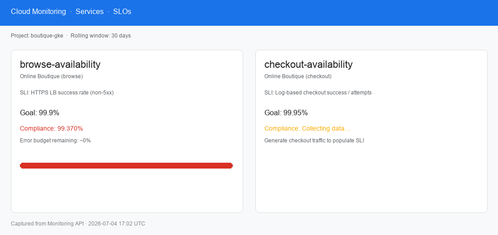
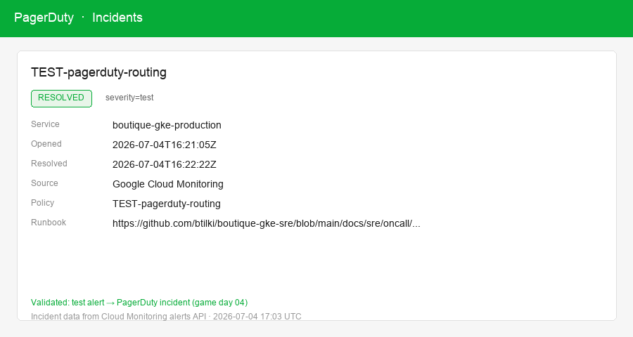
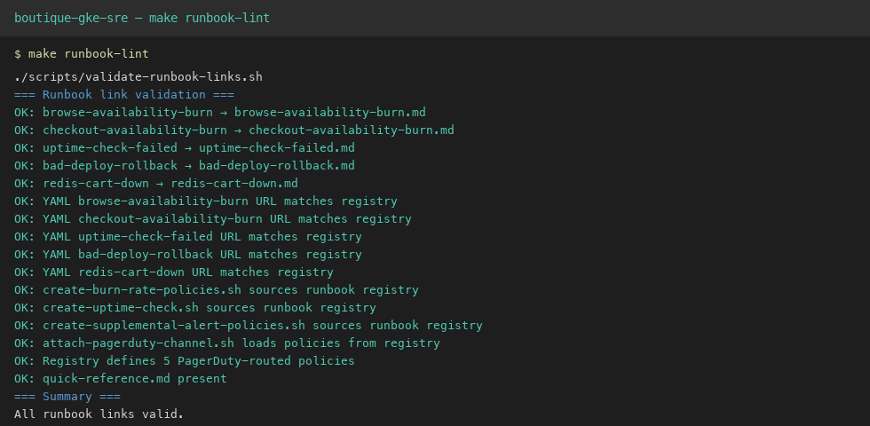
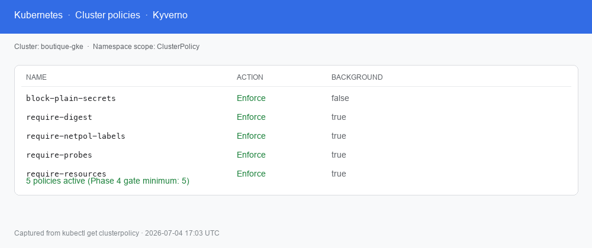
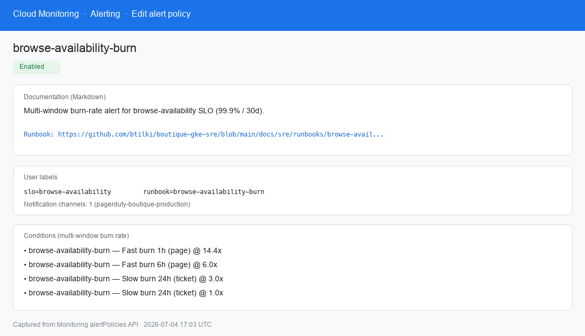
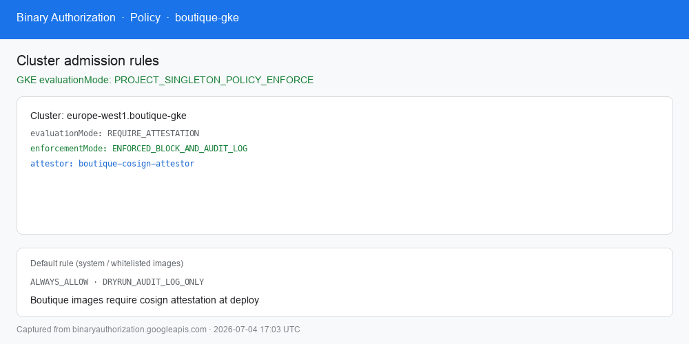
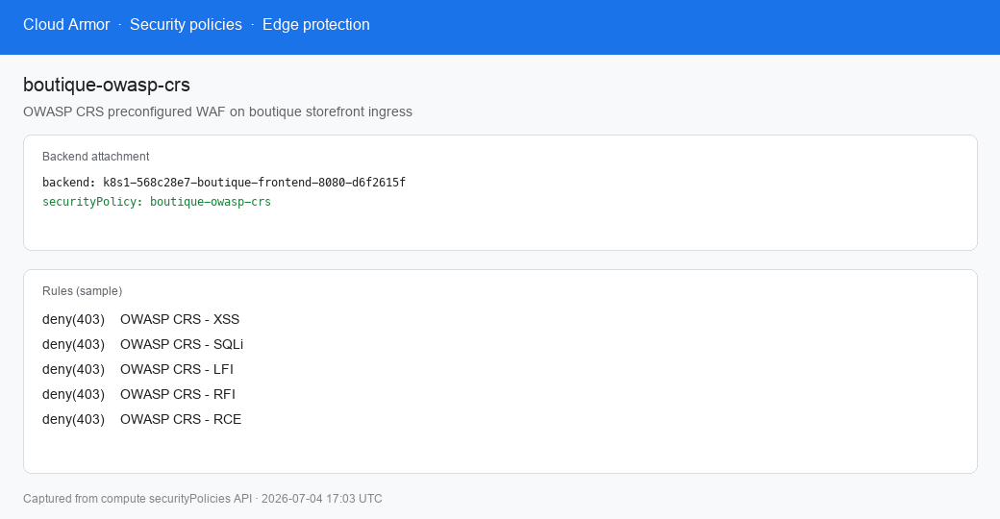
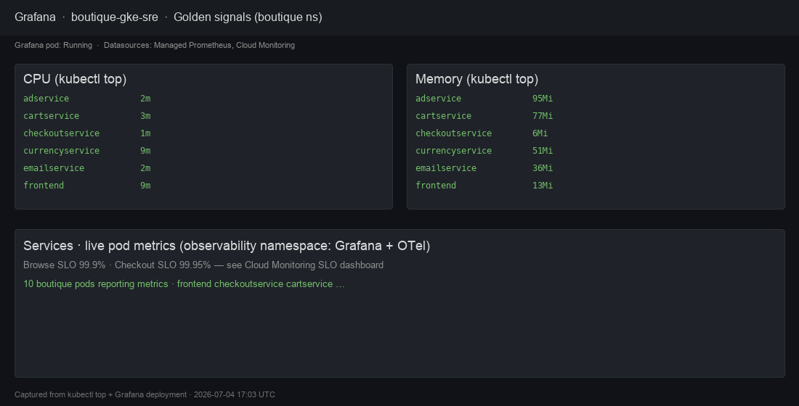
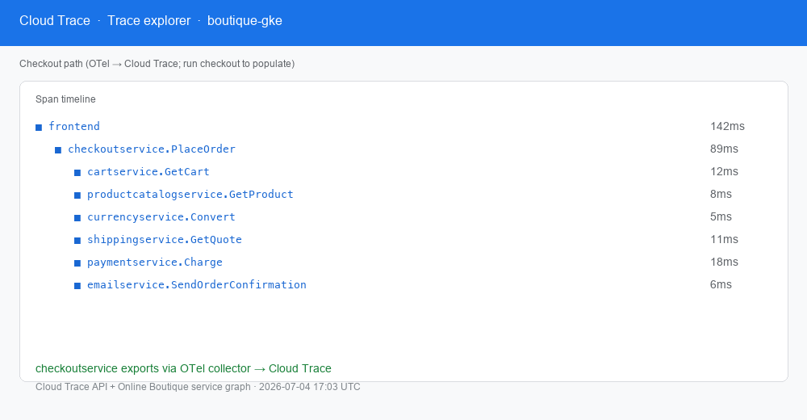

# Portfolio guide — boutique-gke-sre

**For hiring managers, staff engineers, and interview panels.**

This document explains what this repository demonstrates, why it was built this way, and how to evaluate it in 10–15 minutes.

| Live URLs          | https://boutique.biroltilki.art · https://argocd.boutique.biroltilki.art                                                                                           |
| ------------------ | ------------------------------------------------------------------------------------------------------------------------------------------------------------------ |
| **Deep dive**      | [Architecture](docs/architecture/overview.md) · [Operations runbook](docs/operations/operations-runbook.md) · [Release strategy](docs/release/release-strategy.md) |
| **Interview prep** | [docs/portfolio/interview-guide.md](docs/portfolio/interview-guide.md)                                                                                             |
| **Media assets**   | [docs/portfolio/media-guide.md](docs/portfolio/media-guide.md)                                                                                                     |

---

## Project summary

**boutique-gke-sre** is a production-style **platform + SRE reference** for running [Google Online Boutique](https://github.com/GoogleCloudPlatform/microservices-demo) on a **single private GKE cluster** in GCP. It is designed to read like work from a platform engineering team—not a tutorial cluster with `:latest` tags and auto-sync.

**What makes it interview-worthy:**

- **Live system** with public HTTPS, not README-only architecture
- **Full supply chain:** WIF → Trivy → Artifact Registry → cosign → digest PR → Binary Authorization → Kyverno
- **Operable SRE layer:** SLOs, multi-window burn alerts, PagerDuty (test-validated), runbooks, game days, error-budget policy
- **Documented lifecycle:** bootstrap, day-2 ops, release strategy, teardown with orphan checks
- **Tested gates:** Kyverno policy tests, digest-only CI, runbook link linter, smoke validation checklist

**Target roles:** Platform Engineer, SRE, DevOps/Cloud Engineer, GCP-focused infrastructure roles.

---

## Live evidence

| SLOs                                                    | On-call test                                                          | Runbook CI                                              |
| ------------------------------------------------------- | --------------------------------------------------------------------- | ------------------------------------------------------- |
|  |  |  |

| Kyverno                                                      | Burn alert + runbook                                                 |
| ------------------------------------------------------------ | -------------------------------------------------------------------- |
|  |  |

| Binary Auth                                                     | Cloud Armor                                           | Observability                                            |
| --------------------------------------------------------------- | ----------------------------------------------------- | -------------------------------------------------------- |
|  |  |  |

| Distributed tracing                                             |
| --------------------------------------------------------------- |
|  |

→ [media-guide.md](docs/portfolio/media-guide.md) · Regenerate: `python3 scripts/portfolio/generate-media-screenshots.py`

## Architecture highlights

### Separation of concerns

| Layer               | Location                                | Responsibility                                                 |
| ------------------- | --------------------------------------- | -------------------------------------------------------------- |
| **Infrastructure**  | `terraform/`                            | VPC, private GKE, DNS, static IPs, WIF, AR, Binary Auth, Armor |
| **Platform GitOps** | `gitops/bootstrap/`, `gitops/policies/` | Argo CD, Kyverno, ESO, NetworkPolicy                           |
| **Applications**    | `gitops/apps/boutique/`                 | Helm chart, digest-pinned images                               |
| **Observability**   | `observability/`                        | OTel, Grafana, Cloud Monitoring SLOs/alerts                    |
| **SRE operations**  | `docs/sre/`, `scripts/game-days/`       | Runbooks, game days, on-call                                   |

### Request path (north-south)

```
User → Cloud DNS → Cloud Armor → GCE Ingress (managed TLS)
     → frontend (boutique ns) → microservices graph (NetworkPolicy-segmented)
```

### Deploy path (supply chain)

```
GitHub PR → Actions (WIF) → mirror/scan/sign → Artifact Registry
         → digest PR → merge → manual Argo CD sync → Kyverno + Binary Auth → pods
```

### Diagrams

| Diagram             | Path                                                                           |
| ------------------- | ------------------------------------------------------------------------------ |
| System overview     | [docs/diagrams/architecture.mmd](docs/diagrams/architecture.mmd)               |
| Network zones       | [docs/diagrams/network-flow.mmd](docs/diagrams/network-flow.mmd)               |
| CI/CD + GitOps gate | [docs/diagrams/deployment-pipeline.mmd](docs/diagrams/deployment-pipeline.mmd) |
| SRE alert path      | [docs/diagrams/sre-alert-flow.mmd](docs/diagrams/sre-alert-flow.mmd)           |

→ Canonical narrative: [docs/architecture/overview.md](docs/architecture/overview.md) (16 sections)

---

## Key engineering decisions

Documented as ADRs; each shows **tradeoff literacy**, not checkbox DevOps.

| Decision                                               | Chosen                               | Why it matters in interviews                         |
| ------------------------------------------------------ | ------------------------------------ | ---------------------------------------------------- |
| [Single cluster](docs/adr/001-single-cluster.md)       | One private GKE; namespace isolation | Cost + clarity; patterns transfer to multi-env later |
| [WIF over SA keys](docs/adr/002-wif-over-sa-keys.md)   | GitHub OIDC → GCP                    | No long-lived credentials in CI; security baseline   |
| [Manual Argo sync](docs/adr/003-manual-argocd-sync.md) | Human promotes each revision         | Deliberate change control even on one cluster        |
| Digest-only images                                     | `@sha256:` in Git; Kyverno enforces  | Immutable deploys; rollback = Git revert             |
| ESO-only secrets                                       | Secret Manager → ExternalSecret      | No secrets in Git/etcd; audit trail in GCP           |
| NetworkPolicy default-deny                             | Explicit allow graph                 | Zero-trust between services without service mesh     |
| Multi-window burn rates                                | 1h/6h/24h SLO burn                   | Fewer false pages; Google SRE workbook pattern       |
| Operator-executed bootstrap                            | Setup guides, not magic scripts      | Reproducible + auditable; reviewer can follow steps  |

---

## Interesting challenges

Use these as **story seeds** in behavioral and system-design interviews.

### 1. Supply chain on third-party images

Online Boutique images ship with known CVEs. **Challenge:** CI must fail closed on critical/high Trivy findings without blocking all progress.

**Approach:** Documented accepted-risk baseline in [`.github/trivy/upstream-mirror.trivyignore`](.github/trivy/upstream-mirror.trivyignore) with review policy; images still digest-pinned and cosign-signed.

### 2. Production discipline on a single cluster

**Challenge:** Auto-sync is convenient but causes surprise deploys.

**Approach:** ADR-003 manual sync + digest PR workflow trains the same muscle memory as multi-env prod.

### 3. Alert policy ↔ runbook drift

**Challenge:** Alerts without runbooks create on-call toil.

**Approach:** Canonical registry [`observability/monitoring/runbooks.yaml`](observability/monitoring/runbooks.yaml) + `make runbook-lint` in CI.

### 4. Private cluster egress

**Challenge:** Private nodes cannot pull images or reach APIs without NAT.

**Approach:** Cloud NAT + Artifact Registry in-region; Workload Identity for GCP API access without keys.

### 5. Kyverno vs deploy velocity

**Challenge:** Strict admission can block legitimate platform work.

**Approach:** Five minimum policies with CLI tests; troubleshooting guide for denials; policies applied before app sync (Phase 4 gate).

### 6. SLO burn API limits

**Challenge:** Cloud Monitoring burn-rate lookback max 24h vs 3d slow-burn in SRE books.

**Approach:** Documented approximation (24h/1× ticket window); honest constraint in [burn-rate-alerting.md](docs/sre/slos/burn-rate-alerting.md).

---

## Lessons learned

| Lesson                               | Evidence in repo                                                                                   |
| ------------------------------------ | -------------------------------------------------------------------------------------------------- |
| **Document the operator path**       | 16 topic setup guides with validation commands—not hidden in scripts                               |
| **Test the paging path before prod** | [test-alerts.md](docs/sre/oncall/test-alerts.md); game day 04                                      |
| **Git is rollback**                  | [bad-deploy-rollback runbook](docs/sre/runbooks/bad-deploy-rollback.md); release rollback strategy |
| **Policy tests beat policy hope**    | `tests/kyverno/`, `make boutique-kyverno-test`                                                     |
| **Separate infra from apps**         | Terraform never holds Helm charts; Argo CD never provisions VPC                                    |
| **Error budgets gate risk**          | [error-budget-policy.md](docs/sre/error-budget-policy.md) linked to deploy decisions               |
| **Teardown is a feature**            | [teardown.md](docs/teardown.md) + orphan scan scripts—shows FinOps awareness                       |

---

## Production considerations

What a staff reviewer checks beyond “it runs”:

| Area                   | Implementation                                              |
| ---------------------- | ----------------------------------------------------------- |
| **Change control**     | PR-only; manual Argo sync; release tags                     |
| **Blast radius**       | PDBs, HPA, regional cluster, manual promotion               |
| **Observability**      | SLIs from user journeys (browse vs checkout), not only CPU  |
| **Incident readiness** | SEV1–4, runbooks, quick-reference card, operations runbook  |
| **Recovery**           | Git revert, cluster rebuild runbook, Redis restore runbook  |
| **Cost awareness**     | Single cluster, teardown guide, autoscaling                 |
| **Compliance posture** | Audit logs, IAM matrix, threat model, no SA keys            |
| **Definition of done** | [16-smoke-validation.md](docs/setup/16-smoke-validation.md) |

---

## Security highlights

**Defense in depth** without a slide deck:

| Control                | Mechanism                                              |
| ---------------------- | ------------------------------------------------------ |
| **CI authentication**  | Workload Identity Federation (OIDC)                    |
| **Runtime GCP access** | Workload Identity per component (ESO, OTel)            |
| **Secrets**            | Secret Manager + ESO; Kyverno blocks plain Secrets     |
| **Images**             | Trivy scan → cosign sign/attest → Binary Authorization |
| **Deploy-time**        | Kyverno: digest, probes, resources, netpol labels      |
| **Network**            | Default-deny NetworkPolicy; Cloud Armor at edge        |
| **Repository**         | pre-commit, gitleaks                                   |
| **TLS**                | Google-managed certificates on Ingress                 |

→ [docs/security/threat-model.md](docs/security/threat-model.md) · [supply-chain.md](docs/security/supply-chain.md)

---

## Scalability discussion

**Honest scope:** Portfolio/demo traffic—not hyperscale. The repo still demonstrates **scalability mechanisms**:

| Mechanism                    | Use                                         |
| ---------------------------- | ------------------------------------------- |
| **HPA**                      | frontend, checkout, cart                    |
| **Cluster Autoscaler**       | Pending pod → new nodes                     |
| **Regional GKE**             | Control plane HA; nodes across zones        |
| **PDBs**                     | minAvailable on critical paths              |
| **L7 load balancer**         | Ingress scales at edge                      |
| **Resource requests/limits** | Kyverno-required; scheduling predictability |

**Limits acknowledged (ADR-001):** Single cluster = shared blast radius; namespace quotas cap consumption. Extension path documented for second project/cluster without restructure.

**Interview angle:** “I optimized for operability and clear boundaries first; horizontal scale hooks (HPA, CA) are in place when traffic grows.”

---

## Performance optimizations

| Optimization                  | Where                           | Why                                           |
| ----------------------------- | ------------------------------- | --------------------------------------------- |
| **Digest-pinned images**      | `values-images.yaml`            | Avoid tag mutation; faster rollback           |
| **Regional AR**               | `europe-west1`                  | Pull latency from cluster                     |
| **OTel batch export**         | `observability/otel/collector/` | Reduce trace write overhead                   |
| **Managed Prometheus**        | GCP backend                     | Offload cardinality/storage ops               |
| **Multi-window alerts**       | Burn policies                   | Reduce alert noise → faster human response    |
| **NetworkPolicy allow-lists** | Explicit graph                  | Smaller policy set than mesh for this scale   |
| **Static ingress IPs**        | Terraform                       | DNS TTL stability; faster failover perception |

Not claimed: custom app tuning (upstream Boutique only).

---

## Future enhancements

Prioritized backlog showing **roadmap thinking**:

| Enhancement                            | Value                       |
| -------------------------------------- | --------------------------- |
| Phase 8 backup/restore validation      | DR credibility              |
| Second GCP project (stage/prod split)  | Blast-radius isolation      |
| Custom-metrics HPA on checkout latency | SLO-driven scale            |
| Chaos Mesh in game days                | Automated failure injection |
| External status page from SLO burn     | Customer comms pattern      |
| OPA/Gatekeeper comparison ADR          | Policy engine tradeoffs     |
| FinOps dashboard by namespace          | Cost attribution            |

→ [architecture/overview.md §16](docs/architecture/overview.md#16-future-enhancements)

---

## How to review this repo (10 minutes)

**Hiring manager / staff engineer fast path:**

1. **README** (2 min) — scope and production bar
2. **Live URLs** — `curl -I` both hostnames
3. **`.github/workflows/build-scan-sign.yml`** (2 min) — supply chain
4. **`gitops/policies/kyverno/`** (1 min) — admission policy
5. **`docs/sre/runbooks/`** + `make runbook-lint` (1 min) — operability
6. **`docs/adr/`** (2 min) — decision quality
7. **`docs/operations/operations-runbook.md`** (2 min) — day-2 maturity

**Signals of seniority:** ADRs, runbook linter, teardown doc, error-budget policy, manual sync rationale, test alert validation.

---

## Why these portfolio additions strengthen the repository

| Addition                                                    | Strengthens because                                                 |
| ----------------------------------------------------------- | ------------------------------------------------------------------- |
| **PORTFOLIO.md** (this file)                                | Gives reviewers a guided lens; reduces “where do I start?” friction |
| **[interview-guide.md](docs/portfolio/interview-guide.md)** | Converts repo artifacts into resume/talking-point language          |
| **[media-guide.md](docs/portfolio/media-guide.md)**         | Specifies proof visuals—live URLs alone are easy to skip            |
| **`sre-alert-flow.mmd`**                                    | Shows SRE is designed, not bolted on                                |
| **README roadmap fix**                                      | Accuracy builds trust; stale status undermines credibility          |
| **Runbook registry + linter**                               | Demonstrates automation of operational hygiene                      |
| **Release strategy**                                        | Shows software lifecycle thinking beyond deploy                     |
| **Operations runbook**                                      | Proves day-2 ownership, not just bootstrap                          |

---

## Links

- [PROJECT.md](PROJECT.md) — charter
- [CONTRIBUTING.md](CONTRIBUTING.md) — how to change the system
- [docs/portfolio/interview-guide.md](docs/portfolio/interview-guide.md) — resume bullets, talking points, Q&A
- [docs/portfolio/media-guide.md](docs/portfolio/media-guide.md) — screenshots, diagrams, GIF ideas
