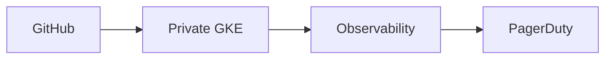

# boutique-gke-sre

> **Infrastructure:** Decommissioned 2026-07-04. Documentation and screenshots remain; public DNS names are **inactive** (no A records until rebuild).

Production-style **platform + SRE** stack for [Google Online Boutique](https://github.com/GoogleCloudPlatform/microservices-demo) on a single private regional GKE cluster in GCP (`boutique-gke`).

Part of the [DevOps Engineering Playbook](https://github.com/btilki/devops-engineering-playbook) · Author: [Birol Tilki](https://www.linkedin.com/in/birol-tilki-48731326/)

**DNS names (inactive):** `boutique.biroltilki.art` · `argocd.boutique.biroltilki.art`

### At a glance (30 seconds)

|                    |                                                                                                                           |
| ------------------ | ------------------------------------------------------------------------------------------------------------------------- |
| **What**           | SRE-focused private GKE platform for Online Boutique — SLOs, burn-rate alerts, runbooks                                   |
| **Lens**           | Reliability after deploy: observability → PagerDuty → incident paths                                                      |
| **Also included**  | GitOps, supply-chain controls, private cluster security baseline                                                          |
| **State**          | Phases 1–8 lived; infra **torn down**; Phase 9 SRE expansion ready to apply on rebuild                                    |
| **Start reading**  | [ARCHITECTURE.md](ARCHITECTURE.md) → [docs/setup/README.md](docs/setup/README.md) → observability / SLO docs              |
| **Playbook brief** | [featured project](https://github.com/btilki/devops-engineering-playbook/blob/main/featured-projects/boutique-gke-sre.md) |

---

## Start here

| Audience                             | Document                                                                                            |
| ------------------------------------ | --------------------------------------------------------------------------------------------------- |
| **Operators and platform engineers** | [docs/setup/README.md](docs/setup/README.md) — topic guides 01–20                                   |
| **Architecture and design**          | [ARCHITECTURE.md](ARCHITECTURE.md) · [docs/architecture/overview.md](docs/architecture/overview.md) |
| **Day-2 operations**                 | [docs/operations/operations-runbook.md](docs/operations/operations-runbook.md)                      |
| **Teardown and lifecycle**           | [docs/teardown.md](docs/teardown.md)                                                                |

---

## What this is

A production-style GCP platform for Online Boutique—not a throwaway demo cluster. One regional private GKE cluster with GitOps, supply-chain controls, observability, SLOs, burn-rate alerting, PagerDuty routing, and runbooks.

→ Architecture: [ARCHITECTURE.md](ARCHITECTURE.md) · [docs/architecture/overview.md](docs/architecture/overview.md)

---

## Operational focus

This repository is the production reference for site reliability of Online Boutique
on Google Cloud: SLOs, alerting, incident response, error budgets, and runbooks.
GitOps and security controls are implemented on a single private GKE cluster.

**DNS names (inactive until rebuild):** `boutique.biroltilki.art` · `argocd.boutique.biroltilki.art`

---

## Repository layout

| Path             | Purpose                              |
| ---------------- | ------------------------------------ |
| `terraform/`     | GCP infrastructure                   |
| `gitops/`        | Argo CD apps, Kyverno, NetworkPolicy |
| `observability/` | OTel, Grafana, SLOs and alerts       |
| `docs/`          | Setup guides, SRE runbooks, security |
| `.github/`       | CI/CD workflows and templates        |

→ Full layout: [REPOSITORY_STRUCTURE.md](REPOSITORY_STRUCTURE.md)

## Tools

Local CLI used by setup guides (topic 01 onward). Validate with `./scripts/bootstrap/validate-prereqs.sh`.

| Tool        | Notes                                    |
| ----------- | ---------------------------------------- |
| `gcloud`    | Google Cloud SDK; project `boutique-gke` |
| `terraform` | ≥ 1.5                                    |
| `kubectl`   | Cluster access after topic 04            |
| `helm`      | v3+ (Argo CD install, topic 09)          |
| `dig`       | DNS checks (topics 05–06, 16)            |
| `curl`      | HTTPS smoke checks                       |

Also useful later: `argocd` CLI, `cosign`, `trivy`, `pre-commit`, `gitleaks`.

---

## Status

| Phase | Focus                               | Status                           |
| ----- | ----------------------------------- | -------------------------------- |
| 1–7   | Bootstrap through smoke validation  | ✅ Complete                      |
| 8     | Teardown + backup/restore           | ✅ Complete                      |
| 9-A–D | SRE expansion (repo + setup guides) | ✅ Repo ready (apply on rebuild) |

→ [ROADMAP.md](ROADMAP.md) · [PROJECT.md](PROJECT.md)

---

## Contributing & license

→ [CONTRIBUTING.md](CONTRIBUTING.md) · [SECURITY.md](SECURITY.md) · [LICENSE](LICENSE) (Apache 2.0)

**CI/CD & workflows:** [.github/workflows/README.md](.github/workflows/README.md)

## Related portfolio

| Resource                                                    | Link                                                                                                  |
| ----------------------------------------------------------- | ----------------------------------------------------------------------------------------------------- |
| **DevOps Engineering Playbook** (hub)                       | https://github.com/btilki/devops-engineering-playbook                                                 |
| Playbook project brief                                      | https://github.com/btilki/devops-engineering-playbook/blob/main/featured-projects/boutique-gke-sre.md |
| Article G1 — SLOs and burn-rate alerts                      | https://github.com/btilki/devops-engineering-playbook/blob/main/articles/G1.md                        |
| Article G2 — Workload Identity Federation (no SA JSON keys) | https://github.com/btilki/devops-engineering-playbook/blob/main/articles/G2.md                        |
| Article G3 — Binary Authorization + Cloud Armor baseline    | https://github.com/btilki/devops-engineering-playbook/blob/main/articles/G3.md                        |
| Sister platform — EKS GitOps                                | https://github.com/btilki/boutique-eks-gitops                                                         |
| Sister platform — AKS DevSecOps                             | https://github.com/btilki/boutique-aks-devsecops                                                      |
| Workshop books                                              | https://github.com/btilki/learn-devops-by-building                                                    |
| LinkedIn                                                    | https://www.linkedin.com/in/birol-tilki-48731326/                                                     |
