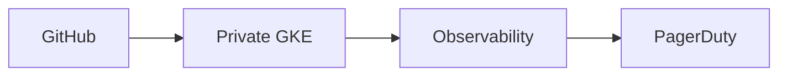

# boutique-gke-sre

Production-grade **platform + SRE reference** for [Google Online Boutique](https://github.com/GoogleCloudPlatform/microservices-demo) on a single private GKE cluster in GCP (`boutique-gke`).

**Live:** https://boutique.biroltilki.art · https://argocd.boutique.biroltilki.art

---

## Start here

| Audience                               | Document                                                                                                                    |
| -------------------------------------- | --------------------------------------------------------------------------------------------------------------------------- |
| **Hiring managers & interview panels** | **[PORTFOLIO.md](PORTFOLIO.md)** — 10-minute review guide, live evidence, architecture highlights, interview talking points |
| Engineers rebuilding the stack         | [docs/setup/README.md](docs/setup/README.md) — topic guides 01–16                                                           |
| Day-2 operations                       | [docs/operations/operations-runbook.md](docs/operations/operations-runbook.md)                                              |

More portfolio material: [docs/portfolio/interview-guide.md](docs/portfolio/interview-guide.md) · [docs/portfolio/media-guide.md](docs/portfolio/media-guide.md)

---

## What this is

A portfolio-quality artifact for platform engineering and SRE roles—not a throwaway demo. One regional private GKE cluster with GitOps, supply-chain controls, observability, SLOs, burn-rate alerting, PagerDuty routing, and runbooks.

→ Architecture: [ARCHITECTURE.md](ARCHITECTURE.md) · [docs/architecture/overview.md](docs/architecture/overview.md)

---

## Repository layout

| Path             | Purpose                              |
| ---------------- | ------------------------------------ |
| `terraform/`     | GCP infrastructure                   |
| `gitops/`        | Argo CD apps, Kyverno, NetworkPolicy |
| `observability/` | OTel, Grafana, SLOs and alerts       |
| `docs/`          | Setup guides, SRE runbooks, security |
| `.github/`       | CI/CD workflows and templates        |

→ Full layout: [REPOSITORY_STRUCTURE.md](REPOSITORY_STRUCTURE.md)

---

## Status

| Phase | Focus                              | Status         |
| ----- | ---------------------------------- | -------------- |
| 1–7   | Bootstrap through smoke validation | ✅ Complete    |
| 8     | Teardown + backup/restore          | 🔄 In progress |

→ [ROADMAP.md](ROADMAP.md) · [PROJECT.md](PROJECT.md)

---

## Contributing & license

→ [CONTRIBUTING.md](CONTRIBUTING.md) · [SECURITY.md](SECURITY.md) · [LICENSE](LICENSE) (Apache 2.0)

**CI/CD & workflows:** [.github/README.md](.github/README.md)
