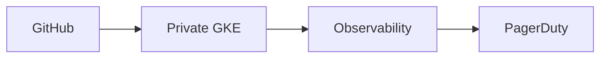

# boutique-gke-sre

> **Infrastructure:** Decommissioned 2026-07-04. Documentation and screenshots remain; live URLs are offline.

Production-grade **platform + SRE** stack for [Google Online Boutique](https://github.com/GoogleCloudPlatform/microservices-demo) on a single private regional GKE cluster in GCP (`boutique-gke`).

**URLs (offline):** https://boutique.biroltilki.art · https://argocd.boutique.biroltilki.art

---

## Start here

| Audience                             | Document                                                                                            |
| ------------------------------------ | --------------------------------------------------------------------------------------------------- |
| **Operators and platform engineers** | [docs/setup/README.md](docs/setup/README.md) — topic guides 01–16                                   |
| **Architecture and design**          | [ARCHITECTURE.md](ARCHITECTURE.md) · [docs/architecture/overview.md](docs/architecture/overview.md) |
| **Day-2 operations**                 | [docs/operations/operations-runbook.md](docs/operations/operations-runbook.md)                      |
| **Teardown and lifecycle**           | [docs/teardown.md](docs/teardown.md)                                                                |

---

## What this is

A production-style GCP platform for Online Boutique—not a throwaway demo cluster. One regional private GKE cluster with GitOps, supply-chain controls, observability, SLOs, burn-rate alerting, PagerDuty routing, and runbooks.

→ Architecture: [ARCHITECTURE.md](ARCHITECTURE.md) · [docs/architecture/overview.md](docs/architecture/overview.md)

---

## Repository layout

| Path             | Purpose                              |
| ---------------- | ------------------------------------ |
| `terraform/`     | GCP infrastructure                   |
| `gitops/`        | Argo CD apps, Kyverno, NetworkPolicy |
| `observability/` | OTel, Grafana, SLOs and alerts       |
| `docs/`          | Setup guides, SRE runbooks, security |
| `.github/`       | CI/CD workflows and templates        |

→ Full layout: [REPOSITORY_STRUCTURE.md](REPOSITORY_STRUCTURE.md)

---

## Status

| Phase | Focus                              | Status      |
| ----- | ---------------------------------- | ----------- |
| 1–7   | Bootstrap through smoke validation | ✅ Complete |
| 8     | Teardown + backup/restore          | ✅ Complete |

→ [ROADMAP.md](ROADMAP.md) · [PROJECT.md](PROJECT.md)

---

## Contributing & license

→ [CONTRIBUTING.md](CONTRIBUTING.md) · [SECURITY.md](SECURITY.md) · [LICENSE](LICENSE) (Apache 2.0)

**CI/CD & workflows:** [.github/workflows/README.md](.github/workflows/README.md)
