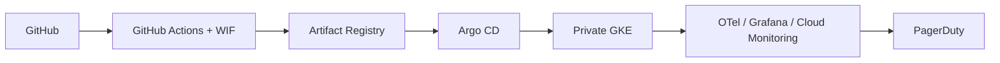

# boutique-gke-sre

## Project overview

Production-grade **site reliability engineering reference** for [Google Online Boutique](https://github.com/GoogleCloudPlatform/microservices-demo) on a **single private GKE cluster** in GCP project `boutique-gke`. This is a portfolio-quality platform engineering artifact — **not** a throwaway demo.

**Who it's for:** Platform engineers, SREs, and reviewers evaluating production readiness on Google Cloud.

**Production bar:** Valid HTTPS on both public hostnames; Kyverno policies enforced; digest-only signed images; live SLOs with burn-rate alerts; PagerDuty routing; one executed game day; validated teardown with zero billing orphans.

## Operational focus

This repository is the production reference for site reliability of Online Boutique
on Google Cloud: SLOs, alerting, incident response, error budgets, and runbooks.
GitOps and security controls are implemented on a single private GKE cluster.

**URLs:** https://boutique.biroltilki.art · https://argocd.boutique.biroltilki.art

## Architecture

Git is the source of truth. GitHub Actions authenticates via Workload Identity Federation (no JSON keys), scans with Trivy, signs with cosign, and promotes image digests through PRs. Argo CD syncs manifests to one regional private cluster where Kyverno, External Secrets Operator, and NetworkPolicy enforce policy at admission and runtime. Observability exports to Cloud Trace, Managed Prometheus, and Grafana; Cloud Monitoring SLOs route to PagerDuty with runbook links.



→ [ARCHITECTURE.md](ARCHITECTURE.md) · [docs/architecture/overview.md](docs/architecture/overview.md)

## Features

- Private regional GKE cluster with Workload Identity and multi-zone node pools
- GitOps via Argo CD with **manual sync** (deliberate promotion)
- Digest-only images; cosign sign + attest; Binary Authorization at deploy
- Kyverno admission policies, ESO + Secret Manager, NetworkPolicy default-deny
- Cloud Armor at edge; Google-managed TLS; static ingress IP
- SLOs (browse 99.9%, checkout 99.95%); multi-window burn-rate alerts; uptime checks
- Runbooks linked from every alert policy; PagerDuty on-call integration
- Game-day scenarios, blameless postmortem template, on-call playbooks
- Bootstrap, backup/restore, and teardown documentation with orphan checks

## Technology stack

| Layer          | Technologies                                                                                                                                                                               |
| -------------- | ------------------------------------------------------------------------------------------------------------------------------------------------------------------------------------------ |
| **GCP-native** | GKE, Cloud DNS, Cloud Monitoring, Cloud Logging, Managed Prometheus, Cloud Trace, Artifact Registry, WIF, Secret Manager, Binary Authorization, Workload Identity, Cloud Armor, GKE Backup |
| **Kubernetes** | Argo CD, Helm, Kyverno, ESO, NetworkPolicy, Prometheus, Grafana, OpenTelemetry, HPA, PDBs, Cluster Autoscaler                                                                              |
| **Platform**   | Terraform, GitHub Actions, Trivy, cosign, PagerDuty, pre-commit, gitleaks                                                                                                                  |

## Repository structure

```
terraform/       # GCP infrastructure (VPC, GKE, DNS, WIF, Armor)
gitops/          # Argo CD apps, bootstrap, Kyverno, NetworkPolicy
observability/   # OTel, Prometheus, Grafana, Cloud Monitoring SLOs
docs/            # Architecture, setup, SRE runbooks, game days
scripts/         # Game-day injection, teardown validation
.github/         # CI: build, scan, sign, manifest PR
examples/        # Reference snippets (ESO, Kyverno, WIF)
tests/           # Kyverno, Terraform, manifest validation
```

→ Full layout: [REPOSITORY_STRUCTURE.md](REPOSITORY_STRUCTURE.md)

## Prerequisites

- GCP project `boutique-gke` with billing and owner access
- Domain `biroltilki.art` with DNS delegatable to Cloud DNS
- GitHub repository with Actions enabled
- PagerDuty account (for alert routing in Phase 7)
- Tools: `gcloud`, `kubectl`, `terraform` (≥ 1.5), `helm`, `gh`, `cosign`, `pre-commit`
- GCP APIs: Container, Compute, DNS, IAM, Artifact Registry, Secret Manager, Monitoring

## Quick start

High-level path from empty project to live URLs (details in setup guides):

1. Clone the repo; copy `terraform/environments/boutique/terraform.tfvars.example` → `terraform.tfvars`
2. Apply Terraform — VPC, GKE, DNS, static IP, WIF, Artifact Registry ([docs/setup/](docs/setup/))
3. Bootstrap Argo CD, Kyverno, ESO, and NetworkPolicy — **Phase 4 gate** before production workloads
4. Deploy Online Boutique via GitOps (digest-only Helm chart); manual Argo CD sync
5. Configure observability, SLOs, and burn-rate alerts
6. Integrate PagerDuty; validate runbook links on alerts
7. Confirm HTTPS and smoke tests on both hostnames:

```bash
curl -I https://boutique.biroltilki.art
curl -I https://argocd.boutique.biroltilki.art
```

→ Step-by-step index: [docs/setup/README.md](docs/setup/README.md)

## Installation

Bootstrap provisions GCP infrastructure, the private cluster, GitOps control plane, policies, application, observability, and on-call integration. You execute each topic guide; the repository holds Terraform, manifests, and documentation.

→ Full guide: [docs/bootstrap.md](docs/bootstrap.md)
→ Ordered setup index: [docs/setup/README.md](docs/setup/README.md)

## Configuration

| Area           | Location                                           | Notes                                          |
| -------------- | -------------------------------------------------- | ---------------------------------------------- |
| Terraform vars | `terraform/environments/boutique/terraform.tfvars` | `project_id`, `region`, `domain`               |
| DNS            | [docs/dns.md](docs/dns.md)                         | NS delegation; A records for boutique + argocd |
| WIF            | `terraform/modules/wif/`                           | GitHub org/repo OIDC binding (Phase 3)         |
| Secrets        | Secret Manager + ESO                               | Never store values in Git                      |
| Image digests  | `gitops/apps/boutique/values-images.yaml`          | CI-updated via PR only                         |

## Deployment

1. CI builds (or mirrors), scans, signs, and pushes image digest to Artifact Registry
2. PR updates Helm values with the new digest
3. Review and merge to `main`
4. Operator performs **manual Argo CD sync**
5. Binary Authorization validates attestations at admission
6. Kyverno enforces digest, probes, resources, and labels
7. Smoke check: `curl -I https://boutique.biroltilki.art`

Rollback: revert digest in Git → manual Argo sync. See [docs/sre/runbooks/bad-deploy-rollback.md](docs/sre/runbooks/bad-deploy-rollback.md).

## CI/CD

```
Build → Trivy (fail critical/high) → push AR (digest) → cosign sign + attest
  → manifest digest PR → review/merge → manual Argo sync → Binary Auth → smoke check
```

| Workflow                                                                             | Purpose                       |
| ------------------------------------------------------------------------------------ | ----------------------------- |
| [.github/workflows/ci.yml](.github/workflows/ci.yml)                                 | Lint, Terraform validate      |
| [.github/workflows/terraform-plan.yml](.github/workflows/terraform-plan.yml)         | `terraform plan` on PR        |
| [.github/workflows/build-scan-sign.yml](.github/workflows/build-scan-sign.yml)       | WIF build pipeline (Phase 3)  |
| [.github/workflows/manifest-digest-pr.yml](.github/workflows/manifest-digest-pr.yml) | Digest promotion PR (Phase 3) |

## GitOps

- **Argo CD UI:** https://argocd.boutique.biroltilki.art
- **Sync policy:** Manual — no surprise deploys (see [ADR 003](docs/adr/003-manual-argocd-sync.md))
- **Namespaces:** `boutique`, `argocd`, `observability`, `kyverno`, `external-secrets`
- **App-of-apps:** [gitops/bootstrap/root-app.yaml](gitops/bootstrap/root-app.yaml)

## Monitoring

| Capability  | Backend                                             |
| ----------- | --------------------------------------------------- |
| SLOs        | Cloud Monitoring (browse 99.9%, checkout 99.95%)    |
| Burn alerts | Multi-window → PagerDuty + runbook link             |
| Dashboards  | Grafana                                             |
| Traces      | Cloud Trace (OpenTelemetry)                         |
| Uptime      | Cloud Monitoring check on `boutique.biroltilki.art` |
| Logs        | Cloud Logging; log-based metrics                    |

Runbooks: [docs/sre/runbooks/](docs/sre/runbooks/) · SLO catalog: [docs/sre/slos/catalog.md](docs/sre/slos/catalog.md)

## Security

- **CI → GCP:** Workload Identity Federation — no long-lived service account keys
- **Pod → GCP:** Workload Identity for API access (ESO, OTel exporters)
- **Secrets:** External Secrets Operator + Secret Manager; Kyverno blocks plain `Secret` resources
- **Images:** Digest-only references; cosign signing; Binary Authorization at deploy
- **Network:** NetworkPolicy default-deny; Cloud Armor on storefront ingress
- **Repository:** pre-commit hooks and gitleaks secret scanning

→ [SECURITY.md](SECURITY.md) · [docs/security/](docs/security/)

## Testing

- **Local / CI:** `make validate` — pre-commit, Terraform fmt/validate
- **Policies:** `make kyverno-test` — Kyverno policy tests ([tests/kyverno/](tests/kyverno/))
- **Manifests:** [tests/manifest/kubeconform.sh](tests/manifest/kubeconform.sh)
- **Alerts:** Fire test policy → PagerDuty incident ([docs/sre/oncall/test-alerts.md](docs/sre/oncall/test-alerts.md))
- **Game days:** [scripts/game-days/](scripts/game-days/) · [docs/sre/game-days/](docs/sre/game-days/)
- **Smoke:** HTTPS headers + checkout flow on live storefront URL

## Documentation

Master index: [docs/DOCUMENTATION.md](docs/DOCUMENTATION.md) · Template: [docs/GUIDE_TEMPLATE.md](docs/GUIDE_TEMPLATE.md)

| Path                                       | Content                          |
| ------------------------------------------ | -------------------------------- |
| [docs/architecture/](docs/architecture/)   | System design, ADRs              |
| [docs/setup/](docs/setup/)                 | Topic-based setup guides (01–16) |
| [docs/sre/runbooks/](docs/sre/runbooks/)   | Alert runbooks                   |
| [docs/sre/game-days/](docs/sre/game-days/) | Game-day scenarios               |
| [docs/sre/oncall/](docs/sre/oncall/)       | On-call playbooks                |
| [docs/teardown.md](docs/teardown.md)       | Safe decommission                |

## Roadmap

| Phase | Focus                         | Status         |
| ----- | ----------------------------- | -------------- |
| 1     | Repo + Terraform foundation   | 🔄 In progress |
| 2     | GKE + DNS + TLS               | ⬜             |
| 3     | WIF + AR + CI                 | ⬜             |
| 4     | Argo CD + policies (**gate**) | ⬜             |
| 5     | Boutique deploy               | ⬜             |
| 6     | Observability + SLOs          | ⬜             |
| 7     | SRE ops + game day            | ⬜             |
| 8     | Teardown + backup             | ⬜             |

→ [ROADMAP.md](ROADMAP.md) · [PROJECT.md](PROJECT.md) · [docs/implementation/roadmap.md](docs/implementation/roadmap.md)

## Contributing

- PR-only manifest changes — no direct `kubectl apply` for production paths
- Run `make validate` and pre-commit before opening a PR
- Promote image digests via CI PR; do not hand-edit `:latest` tags
- Manual Argo CD sync after merge — prod-style discipline on a single cluster

→ [CONTRIBUTING.md](CONTRIBUTING.md)

## License

Apache License 2.0 — see [LICENSE](LICENSE).

## References

- [Google Online Boutique](https://github.com/GoogleCloudPlatform/microservices-demo)
- [GKE private clusters](https://cloud.google.com/kubernetes-engine/docs/how-to/private-clusters)
- [Argo CD](https://argo-cd.readthedocs.io/)
- [Workload Identity Federation](https://cloud.google.com/iam/docs/workload-identity-federation)
- [Cloud Monitoring SLOs](https://cloud.google.com/stackdriver/docs/solutions/slo-monitoring)
- [Kyverno](https://kyverno.io/)
- [External Secrets Operator](https://external-secrets.io/)
