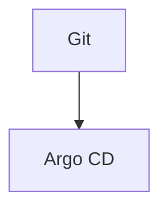

# Diagrams

Mermaid (`.mmd`) sources and operational PNG screenshots referenced from architecture and setup documentation. Render in GitHub, VS Code, or export as PNG/SVG for presentations.

## Purpose

Provide version-controlled diagrams for onboarding, architecture reviews, and setup validation. Mermaid sources (`.mmd`) are canonical; PNG screenshots document live validation checkpoints from setup topics.

## Inputs

| Input                  | Source                                                          | Description                        |
| ---------------------- | --------------------------------------------------------------- | ---------------------------------- |
| Architecture decisions | [architecture/overview.md](../../docs/architecture/overview.md) | Components and flows to illustrate |
| Setup topics           | [setup/](../../docs/setup/)                                     | Bootstrap and deploy sequences     |

## Outputs

| File                                               | Description                            |
| -------------------------------------------------- | -------------------------------------- |
| [architecture.mmd](architecture.mmd)               | Component and data-plane overview      |
| [network-flow.mmd](network-flow.mmd)               | VPC, ingress, NetworkPolicy zones      |
| [deployment-pipeline.mmd](deployment-pipeline.mmd) | CI → GitOps → deploy gate              |
| [sre-alert-flow.mmd](sre-alert-flow.mmd)           | SLO → burn alert → PagerDuty → runbook |

### Screenshots (setup validation)

| File                                                                                     | Description                              | Referenced in                                                                                                                      |
| ---------------------------------------------------------------------------------------- | ---------------------------------------- | ---------------------------------------------------------------------------------------------------------------------------------- |
| [boutique-storefront-https.png](boutique-storefront-https.png)                           | Storefront over HTTPS                    | [12-boutique-deploy.md](../../docs/setup/12-boutique-deploy.md), [16-smoke-validation.md](../../docs/setup/16-smoke-validation.md) |
| [argocd-applications-healthy-synced.png](argocd-applications-healthy-synced.png)         | Argo CD apps Synced/Healthy              | [16-smoke-validation.md](../../docs/setup/16-smoke-validation.md)                                                                  |
| [github-actions-build-scan-sign-success.png](github-actions-build-scan-sign-success.png) | Green `build-scan-sign` workflow         | [12-boutique-deploy.md](../../docs/setup/12-boutique-deploy.md)                                                                    |
| [github-actions-trivy-scan-failure.png](github-actions-trivy-scan-failure.png)           | Trivy gate before `trivyignore` baseline | [12-boutique-deploy.md](../../docs/setup/12-boutique-deploy.md)                                                                    |
| [pagerduty-service-events-api-v2.png](pagerduty-service-events-api-v2.png)               | PagerDuty Events API V2 integration      | [14-pagerduty.md](../../docs/setup/14-pagerduty.md)                                                                                |
| [slo-browse-checkout.png](slo-browse-checkout.png)                                       | SLO dashboard (Monitoring API)           | [13-observability-slos.md](../../docs/setup/13-observability-slos.md)                                                              |
| [runbook-lint-success.png](runbook-lint-success.png)                                     | `make runbook-lint` success              | [operations-runbook.md](../../docs/operations/operations-runbook.md)                                                               |
| [pagerduty-test-incident.png](pagerduty-test-incident.png)                               | TEST alert → PagerDuty incident          | [test-alerts.md](../../docs/sre/oncall/test-alerts.md)                                                                             |
| [kyverno-five-policies.png](kyverno-five-policies.png)                                   | Kyverno ClusterPolicies (Enforce)        | [11-kyverno-policies.md](../../docs/setup/11-kyverno-policies.md)                                                                  |
| [alert-policy-runbook-link.png](alert-policy-runbook-link.png)                           | Burn alert documentation + runbook URL   | [13-observability-slos.md](../../docs/setup/13-observability-slos.md)                                                              |
| [binary-auth-enforced.png](binary-auth-enforced.png)                                     | Binary Authorization cluster admission   | [supply-chain.md](../../docs/security/supply-chain.md)                                                                             |
| [cloud-armor-ingress.png](cloud-armor-ingress.png)                                       | Cloud Armor WAF on storefront backend    | [15-cloud-armor.md](../../docs/setup/15-cloud-armor.md)                                                                            |
| [grafana-boutique-dashboard.png](grafana-boutique-dashboard.png)                         | Grafana + live pod metrics (boutique ns) | [13-observability-slos.md](../../docs/setup/13-observability-slos.md)                                                              |
| [cloud-trace-checkout.png](cloud-trace-checkout.png)                                     | Checkout distributed trace span tree     | [13-observability-slos.md](../../docs/setup/13-observability-slos.md)                                                              |

Regenerate screenshots (API + terminal):

```bash
python3 scripts/media/generate-media-screenshots.py
```

## Dependencies

- Mermaid-compatible renderer (GitHub, VS Code Mermaid extension, [mermaid.live](https://mermaid.live))
- Cross-referenced from [architecture/overview.md](../../docs/architecture/overview.md)

## Usage

Preview locally:

```bash
# VS Code: open any .mmd file with Mermaid preview
# Or paste source into https://mermaid.live
```

Embed in Markdown (GitHub renders fenced mermaid blocks):

````markdown

````

Export PNG (optional, requires [mermaid-cli](https://github.com/mermaid-js/mermaid-cli)):

```bash
npx -p @mermaid-js/mermaid-cli mmdc -i assets/diagrams/architecture.mmd -o assets/architecture.png
```

## Related

- [architecture/](../../docs/architecture/) — narrative architecture docs
