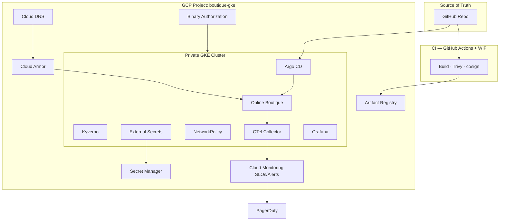

# Architecture overview — boutique-gke-sre

Canonical system design for the production SRE reference: Google Online Boutique on one private regional GKE cluster in GCP project `boutique-gke`, domain `biroltilki.art`.

**Public URLs:** https://boutique.biroltilki.art · https://argocd.boutique.biroltilki.art

**Diagram sources:** [assets/diagrams/](../../assets/diagrams/)

---

## 1. Requirements

### Functional

| ID  | Requirement                                                                |
| --- | -------------------------------------------------------------------------- |
| F1  | Run full Online Boutique microservice stack from upstream container images |
| F2  | Public HTTPS storefront at `https://boutique.biroltilki.art`               |
| F3  | Argo CD UI at `https://argocd.boutique.biroltilki.art` with manual sync    |
| F4  | GitOps deploy: all cluster state from Git; changes via PR only             |
| F5  | CI builds/scans/signs images; promotes digests to manifests via PR         |
| F6  | Secrets from Secret Manager via ESO — never plain Secrets in Git           |
| F7  | Observability: metrics, logs, traces exportable to GCP backends            |
| F8  | SLOs with burn-rate alerts routed to PagerDuty + runbook links             |
| F9  | Bootstrap, backup/restore, and teardown documented and validated           |

### Non-functional

| ID   | Requirement               | Target                                               |
| ---- | ------------------------- | ---------------------------------------------------- |
| NF1  | Browse availability SLO   | 99.9% monthly                                        |
| NF2  | Checkout availability SLO | 99.95% monthly                                       |
| NF3  | Browse latency SLO        | p95 < 500ms                                          |
| NF4  | Checkout latency SLO      | p95 < 1000ms                                         |
| NF5  | Image immutability        | Digest-only; reject `:latest`                        |
| NF6  | Supply chain              | cosign sign + attest; Binary Authorization at deploy |
| NF7  | Policy enforcement        | Kyverno admission + NetworkPolicy default-deny       |
| NF8  | Node privacy              | Private GKE nodes; egress via Cloud NAT              |
| NF9  | Incident readiness        | SEV1–SEV4 taxonomy; runbook per alert                |
| NF10 | Recoverability            | Backup/restore runbook for Redis/cart state          |

---

## 2. Constraints

- **Single GCP project** (`boutique-gke`) — no dev/stage/prod project split
- **Single regional GKE cluster** — isolation via Kubernetes namespaces only
- **GCP-only** — no multi-cloud abstraction layer
- **No service mesh** as default (no Istio/Linkerd in baseline)
- **No custom app code** — upstream Online Boutique images only
- **Manual Argo CD sync** — deliberate promotion even on a single cluster
- **WIF-only CI auth** — no long-lived GCP service account keys in GitHub
- **Operator-executed provisioning** — Terraform and setup guides; no opaque automation scripts

---

## 3. Assumptions

| Assumption       | Detail                                                               |
| ---------------- | -------------------------------------------------------------------- |
| Domain ownership | `biroltilki.art` registered; NS delegatable to Cloud DNS             |
| GCP project      | `boutique-gke` exists with billing and owner access                  |
| GitHub           | Org/repo with Actions; OIDC trust to WIF pool                        |
| PagerDuty        | Account with service + integration key for alert routing             |
| Region           | Single GCP region (`europe-west1`) with 3 zones for regional cluster |
| Traffic          | Portfolio/demo levels; not hyperscale                                |
| Images           | Mirrored to Artifact Registry with digest pinning                    |
| Team model       | Platform engineer + SRE patterns; on-call documented                 |

---

## 4. High-level architecture

Git is the single source of truth. Engineers merge PRs that update Helm values (image digests) and platform manifests. GitHub Actions authenticates to GCP via Workload Identity Federation, builds or mirrors images, scans with Trivy, signs with cosign, and pushes to Artifact Registry. Argo CD watches the repo and syncs desired state to a **single private regional GKE cluster**. Platform components (Kyverno, ESO, NetworkPolicy) enforce security at admission and runtime.

Online Boutique runs in the `boutique` namespace; Argo CD in `argocd`; observability in `monitoring`. North-south traffic enters through a Google Cloud external HTTP(S) load balancer with a static IP, Google-managed TLS certificates, and Cloud Armor. OpenTelemetry exports to Cloud Trace and Managed Prometheus; Grafana visualizes health. Cloud Monitoring hosts SLOs, uptime checks, and burn-rate alerts that route to PagerDuty with runbook links in `docs/sre/runbooks/`.



---

## 5. Component diagram

| Layer             | Components                                                             | Responsibility                                                  |
| ----------------- | ---------------------------------------------------------------------- | --------------------------------------------------------------- |
| **IaC**           | Terraform (`terraform/`)                                               | VPC, GKE, DNS, static IP, IAM, WIF, AR, Binary Auth, monitoring |
| **Edge**          | Cloud DNS, static IP, GCE Ingress, managed certs, Cloud Armor          | HTTPS, WAF, routing                                             |
| **GitOps**        | Argo CD (`gitops/bootstrap/`, `gitops/apps/`)                          | Sync cluster state; manual sync gate                            |
| **Policy**        | Kyverno (`gitops/policies/kyverno/`)                                   | Admission: digest, probes, resources, labels, no plain Secrets  |
| **Secrets**       | ESO (`gitops/bootstrap/external-secrets/`)                             | Secret Manager → Kubernetes Secrets                             |
| **Network**       | NetworkPolicy (`gitops/policies/network-policies/`)                    | Default-deny; explicit service graph                            |
| **Application**   | Online Boutique Helm (`gitops/apps/boutique/`)                         | Microservices + frontend                                        |
| **Observability** | OTel, Prometheus, Grafana (`observability/`)                           | Collect, store, visualize                                       |
| **SRE**           | Cloud Monitoring, PagerDuty (`observability/monitoring/`, `docs/sre/`) | SLOs, alerts, runbooks, game days                               |
| **CI**            | GitHub Actions (`.github/workflows/`)                                  | WIF auth, scan, sign, digest PR                                 |
| **Backup**        | GKE Backup / Velero (`scripts/`, runbooks)                             | Redis/cart state protection                                     |

---

## 6. Data flow

### User request path

```
User browser
  → DNS (boutique.biroltilki.art → static IP)
  → Cloud Armor (WAF / rate limits)
  → GCE Ingress (TLS termination, Google-managed cert)
  → frontend Service (boutique namespace)
  → frontend Pod
      → adservice, cartservice, checkoutservice, currencyservice,
         emailservice, paymentservice, productcatalogservice,
         recommendationservice, shippingservice
      → cartservice → Redis (StatefulSet)
      → checkoutservice → paymentservice, emailservice, shippingservice
```

### Telemetry path

```
App pods (OTel SDK / collector)
  → OTel Collector (monitoring namespace)
  → Cloud Trace (traces)
  → Managed Prometheus (metrics)
  → Cloud Logging (stdout / logging exporter)
  → Error Reporting (unhandled exceptions)
  → Grafana (dashboards)
```

### Secret path

```
Secret Manager (GCP)
  → ESO ExternalSecret (external-secrets namespace)
  → Kubernetes Secret (target namespace, e.g. boutique)
  → Pod env / volume mount
```

---

## 7. Deployment flow

```
1. Merge or CI trigger on main
2. GitHub Actions: WIF auth (OIDC → GCP SA)
3. Build/mirror image → Trivy scan (fail critical/high)
4. Push to Artifact Registry (immutable digest)
5. cosign sign + SLSA/provenance attestation
6. CI opens PR with digest in gitops/apps/boutique/values-images.yaml
7. Human review + merge
8. Operator manually syncs Argo CD Application
9. Binary Authorization evaluates attestations
10. Kyverno validates digest, probes, resources, labels
11. Pods roll out; readiness probes pass
12. Smoke: curl -I https://boutique.biroltilki.art
```

**Rollback:** Revert digest in Git → manual Argo sync → previous ReplicaSet restored.
→ [Runbook: bad deploy rollback](../sre/runbooks/bad-deploy-rollback.md)

---

## 8. Network flow

### VPC layout (Phase 1 — implemented)

```
boutique-vpc (custom, regional)
├── boutique-gke-subnet (10.10.0.0/20) — nodes
│   ├── secondary boutique-pods (10.20.0.0/16)
│   └── secondary boutique-services (10.30.0.0/20)
├── Cloud Router + boutique-nat — private egress
├── Private Google Access — GCP APIs without public node IPs
└── Firewall — health checks (35.191.0.0/16, 130.211.0.0/22); internal CIDRs
```

### GKE networking (Phase 2+)

- Private cluster: node IPs not publicly routable
- Authorized networks or IAP for control plane admin access
- GCE Ingress provisions external HTTP(S) load balancer
- Static global IP from Terraform; bound via Ingress annotations

### NetworkPolicy model (default-deny)

| Namespace          | Ingress from                       | Egress to                              |
| ------------------ | ---------------------------------- | -------------------------------------- |
| `boutique`         | Ingress controller, same-namespace | DNS, service deps, OTel collector      |
| `argocd`           | Ingress (argocd host)              | Git, Kubernetes API                    |
| `monitoring`       | All namespaces (scrape)            | Managed Prometheus, Grafana deps       |
| `kyverno`          | Kubernetes API                     | Admission webhook targets              |
| `external-secrets` | Kubernetes API                     | Secret Manager (Private Google Access) |

Pods require label `network-policy/boutique: "true"` (enforced by Kyverno policy #4).

→ [network-flow.mmd](../../assets/diagrams/network-flow.mmd)

---

## 9. Security boundaries

| Boundary        | Mechanism                        | Notes                                           |
| --------------- | -------------------------------- | ----------------------------------------------- |
| CI → GCP        | WIF (OIDC trust GitHub repo/ref) | Short-lived tokens; scoped SA per workflow      |
| Pod → GCP       | Workload Identity                | ESO SA in `external-secrets`                    |
| Image trust     | cosign + Binary Authorization    | Unsigned images rejected at deploy              |
| Admission       | Kyverno                          | Blocks `:latest`, missing probes, plain Secrets |
| Runtime network | NetworkPolicy                    | Default-deny; explicit allows                   |
| Edge            | Cloud Armor                      | OWASP CRS baseline                              |
| Secrets         | Secret Manager + ESO             | gitleaks in pre-commit                          |
| Audit           | Cloud Audit Logs                 | Admin and data access                           |
| TLS             | Google-managed certs             | Auto-renewal on Ingress                         |

**Trust zones:**

```
Internet (untrusted)
  → Cloud Armor + TLS
  → Ingress (cluster edge)
  → boutique namespace (NetworkPolicy segmented)
  → platform namespaces (restricted RBAC)
  → GCP APIs (Workload Identity scoped)
```

→ [docs/security/threat-model.md](../security/threat-model.md) · [iam-matrix.md](../security/iam-matrix.md)

---

## 10. Failure scenarios

| Scenario                 | Impact                  | Detection                        | Mitigation                                                                                 |
| ------------------------ | ----------------------- | -------------------------------- | ------------------------------------------------------------------------------------------ |
| Zone loss                | Reduced capacity        | Node NotReady; PDB violations    | Regional cluster; HPA; Cluster Autoscaler                                                  |
| Bad deploy               | Errors, failed rollout  | Argo degraded; SLO burn          | Git revert + Argo sync; [bad-deploy-rollback](../sre/runbooks/bad-deploy-rollback.md)      |
| Redis/cart down          | Cart/checkout failures  | cartservice health; checkout SLO | Restart StatefulSet; [redis-cart-down](../sre/runbooks/redis-cart-down.md); backup restore |
| Ingress/TLS failure      | External outage         | Uptime check failed              | Cert status, Ingress events, static IP                                                     |
| Kyverno/ESO down         | Deploys/secrets blocked | Platform health alerts           | PDB; priority Argo sync                                                                    |
| Monitoring pipeline down | Blind spots             | Metric heartbeat missing         | OTel HPA; Cloud Logging fallback                                                           |
| Binary Auth misconfig    | All deploys blocked     | Admission failures               | Fix attestor in Terraform; break-glass doc                                                 |
| WIF/CI failure           | No image promotion      | Actions failure                  | Validate pool/provider; no key fallback                                                    |

---

## 11. Scalability

| Mechanism                | Use                                          |
| ------------------------ | -------------------------------------------- |
| HPA                      | frontend, checkout, cart — CPU/request-based |
| Cluster Autoscaler       | Scale nodes when pods pending                |
| Regional cluster         | Control plane HA; nodes across 3 zones       |
| PDBs                     | minAvailable on critical services            |
| Resource requests/limits | Kyverno-required; prevents noisy neighbor    |
| GCE load balancer        | L7 scaling at ingress                        |

Single-cluster limits: no hard blast-radius between logical envs; namespace quotas cap consumption. Sufficient for reference traffic.

---

## 12. Disaster recovery

| Asset           | RPO  | RTO     | Method                                                                    |
| --------------- | ---- | ------- | ------------------------------------------------------------------------- |
| Redis (cart)    | < 1h | < 30m   | GKE Backup / Velero; [redis-restore](../sre/runbooks/redis-restore.md)    |
| Git state       | 0    | minutes | GitHub; Argo resync                                                       |
| Terraform state | 0    | hours   | GCS versioned backend                                                     |
| Secrets         | 0    | minutes | Secret Manager versions; ESO resync                                       |
| Cluster         | N/A  | hours   | Terraform re-apply; [cluster-rebuild](../sre/runbooks/cluster-rebuild.md) |

Teardown destroy order: [teardown.md](../teardown.md)

---

## 13. Observability — signal ownership

| Signal      | Owner    | Backend            | Consumer                                 |
| ----------- | -------- | ------------------ | ---------------------------------------- |
| SLOs / SLIs | SRE      | Cloud Monitoring   | Error budgets, burn alerts → PagerDuty   |
| Uptime      | SRE      | Cloud Monitoring   | `boutique.biroltilki.art` external check |
| Dashboards  | Platform | Grafana            | On-call, game days                       |
| Metrics     | Platform | Managed Prometheus | Grafana, SLO queries                     |
| Traces      | Platform | Cloud Trace        | Checkout path debugging                  |
| Logs        | Platform | Cloud Logging      | Log-based metrics, triage                |
| Errors      | App/SRE  | Error Reporting    | Exception aggregation                    |
| Alerts      | SRE      | Cloud Monitoring   | PagerDuty + runbook URL                  |

**SLO catalog:** [docs/sre/slos/catalog.md](../sre/slos/catalog.md)

| Service           | SLI                        | Target           |
| ----------------- | -------------------------- | ---------------- |
| Browse (frontend) | Availability + p95 latency | 99.9% / <500ms   |
| Checkout          | Availability + p95 latency | 99.95% / <1000ms |

---

## 14. Cost considerations

- **Single cluster** — lower baseline vs multi-cluster; one control plane bill
- **Private nodes + NAT** — NAT egress charges at reference scale
- **Managed Prometheus + Cloud Monitoring** — tune retention; avoid high-cardinality labels
- **Static IP + LB** — fixed monthly cost while cluster exists
- **Node pool** — autoscaling min sized for demo; tear down when idle
- **GKE Backup** — GCS storage for Redis backups per RPO

---

## 15. Tradeoffs

| Decision         | Chosen                  | Rejected                   | Rationale                               |
| ---------------- | ----------------------- | -------------------------- | --------------------------------------- |
| One cluster      | Namespace isolation     | Multi-project/cluster      | Cost, simplicity; patterns transferable |
| Manual Argo sync | Operator approves       | Auto-sync                  | No surprise deploys; prod discipline    |
| No service mesh  | NetworkPolicy + Ingress | Istio/Linkerd              | Ops burden exceeds Boutique needs       |
| Upstream images  | Mirror + digest pin     | Custom fork                | SRE depth over app dev                  |
| GCE Ingress      | GCP LB + Armor          | nginx-only                 | Native TLS, Armor, static IP            |
| WIF              | OIDC federation         | SA JSON keys               | Security baseline                       |
| ESO-only secrets | Secret Manager          | Sealed Secrets / plain K8s | GCP-native audit trail                  |

ADRs: [001](../adr/001-single-cluster.md) · [002](../adr/002-wif-over-sa-keys.md) · [003](../adr/003-manual-argocd-sync.md)

---

## 16. Future enhancements

- Second GCP project for prod/stage isolation
- Multi-region GKE + Cloud CDN
- Service mesh (Istio ambient / Linkerd) for mTLS
- Custom-metrics HPA on checkout latency
- Chaos Mesh in quarterly game days
- FinOps dashboards by namespace label
- External status page wired to SLO burn
- OPA Gatekeeper for cross-cloud policy uniformity

---

## Canonical stack flow

```
Git (GitHub) — source of truth
│
▼
GitHub Actions (WIF → GCP) + Trivy + cosign
│
▼
Artifact Registry + Binary Authorization
│
▼
Argo CD → ONE private GKE cluster
  Helm · Kyverno · ESO · NetworkPolicy
│
▼
HTTPS (Cloud Armor · managed TLS · static IP)
  boutique.biroltilki.art · argocd.boutique.biroltilki.art
│
▼
OTel → Cloud Trace / Managed Prometheus / Grafana
Cloud Monitoring SLOs → PagerDuty ← runbooks (docs/sre/)
```

## Related documentation

- [ARCHITECTURE.md](../../ARCHITECTURE.md) — executive summary
- [bootstrap.md](../bootstrap.md) — bootstrap path
- [implementation/roadmap.md](../implementation/roadmap.md) — phased delivery
