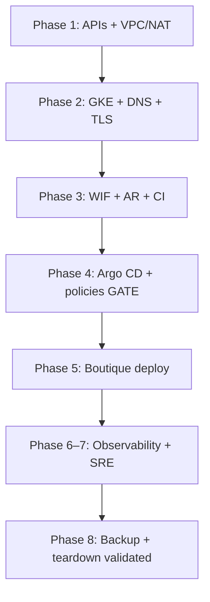

# Bootstrap — boutique-gke-sre

## Purpose

Provide the executive path from an empty GCP project to production-ready URLs for Online Boutique and Argo CD on a single private GKE cluster.

**Target URLs:** https://boutique.biroltilki.art · https://argocd.boutique.biroltilki.art

## When to use

- First-time platform build for this repository
- Rebuilding after full teardown
- Onboarding a new engineer who needs the big picture before topic guides

**Alternative:** Jump directly to [setup/README.md](setup/README.md) if you already know the current step.

## Prerequisites

- GCP account with project `boutique-gke` (or permission to create it)
- Domain `biroltilki.art` with registrar access
- Repository on disk (`git clone` or local `git init`; GitHub remote required by topic 07)
- Tools: `gcloud`, `terraform` ≥ 1.5 (full list in [README](../README.md))

## Architecture

Bootstrap walks through layers in dependency order:



| Stage             | Setup topics      | Implementation phase |
| ----------------- | ----------------- | -------------------- |
| Foundation        | 01–03             | 1                    |
| Cluster + edge    | 04–06             | 2                    |
| Supply chain      | 07–08             | 3                    |
| Platform **gate** | 09–11             | 4                    |
| Application       | 12                | 5                    |
| SRE               | 13–16             | 6–7                  |
| Lifecycle         | teardown + backup | 8                    |

**Critical:** Do not skip topics 09–11 (Argo CD, ESO, Kyverno) before treating the cluster as production-ready.

## Step-by-step implementation

Execute topic guides in order. Confirm each before proceeding.

1. [01 — GCP project and APIs](setup/01-gcp-project-apis.md)
2. [02 — Terraform remote state](setup/02-terraform-remote-state.md)
3. [03 — VPC and Cloud NAT](setup/03-vpc-nat.md)
4. Continue through [setup/README.md](setup/README.md) through topic 16

After Phase 1 (topics 01–03): `make validate`, commit, proceed to Phase 2.

## Validation

### After Phase 1 (topics 01–03)

See [03 — VPC and Cloud NAT](setup/03-vpc-nat.md) validation section. Quick check:

```bash
cd terraform/environments/boutique
terraform output network_name
terraform output subnet_name
gcloud compute networks describe boutique-vpc --project=boutique-gke
make validate
```

### When bootstrap is complete

Run the full checklist in [16 — Smoke validation](setup/16-smoke-validation.md). Quick HTTPS check:

```bash
# Dual static IPs (boutique-ingress-ip + argocd-ingress-ip)
gcloud compute addresses list --global --project=boutique-gke \
  --filter="name:(boutique-ingress-ip OR argocd-ingress-ip)" \
  --format="table(name,address)"

dig +short boutique.biroltilki.art
dig +short argocd.boutique.biroltilki.art
curl -I https://boutique.biroltilki.art
curl -I https://argocd.boutique.biroltilki.art
```

Expected: each hostname resolves to its matching static IP; HTTPS returns `HTTP/2 200` or `302` without TLS errors.

Post-smoke hardening (Binary Auth enforce, Argo CD WAF): [security/edge-hardening.md](security/edge-hardening.md).

## Troubleshooting

| Symptom              | Cause                | Fix                                                                          |
| -------------------- | -------------------- | ---------------------------------------------------------------------------- |
| Stuck on Phase 1     | State bucket or APIs | [01](setup/01-gcp-project-apis.md), [02](setup/02-terraform-remote-state.md) |
| TLS never provisions | DNS not delegated    | [dns.md](dns.md), [05](setup/05-cloud-dns.md)                                |
| Deploy blocked       | Skipped Phase 4 gate | Complete [09–11](setup/09-argocd-bootstrap.md)                               |

## Common mistakes

- Applying Boutique before Kyverno/ESO/NetworkPolicy
- Using SA JSON keys in GitHub instead of WIF
- Auto-syncing Argo CD on a “prod-style” reference cluster

## Best practices

- One phase per session: validate → commit → next
- Keep Terraform and GitOps changes in separate PRs when possible
- Link every alert policy to a runbook before declaring SRE complete

## Production considerations

- Single cluster — namespace isolation only; document blast radius in [architecture/overview.md](architecture/overview.md)
- Right-size node pools; tear down when not learning to control cost
- Manual Argo CD sync is intentional ([ADR 003](adr/003-manual-argocd-sync.md))

## Security considerations

- WIF only for CI; ESO only for secrets; digest-only images
- See [security/supply-chain.md](security/supply-chain.md)

## Further reading

- [dns.md](dns.md) · [teardown.md](teardown.md)
- [architecture/overview.md](architecture/overview.md)
- [implementation/roadmap.md](implementation/roadmap.md)
- After bootstrap: [16-smoke-validation.md](setup/16-smoke-validation.md), [edge-hardening.md](security/edge-hardening.md), [game-days/01-bad-deploy-rollback.md](sre/game-days/01-bad-deploy-rollback.md), [oncall/README.md](sre/oncall/README.md)
