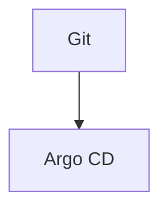

# Diagrams

Mermaid (`.mmd`) sources referenced from architecture and setup documentation. Render in GitHub, VS Code, or export to `assets/` as PNG/SVG for presentations.

## Purpose

Provide version-controlled, text-based diagrams for onboarding, architecture reviews, and SRE runbooks without binary assets in Git.

## Inputs

| Input                  | Source                                                  | Description                        |
| ---------------------- | ------------------------------------------------------- | ---------------------------------- |
| Architecture decisions | [architecture/overview.md](../architecture/overview.md) | Components and flows to illustrate |
| Setup topics           | [setup/](../setup/)                                     | Bootstrap and deploy sequences     |

## Outputs

| File                                               | Description                       |
| -------------------------------------------------- | --------------------------------- |
| [architecture.mmd](architecture.mmd)               | Component and data-plane overview |
| [network-flow.mmd](network-flow.mmd)               | VPC, ingress, NetworkPolicy zones |
| [deployment-pipeline.mmd](deployment-pipeline.mmd) | CI → GitOps → deploy gate         |

## Dependencies

- Mermaid-compatible renderer (GitHub, VS Code Mermaid extension, [mermaid.live](https://mermaid.live))
- Cross-referenced from [architecture/overview.md](../architecture/overview.md)

## Usage

Preview locally:

```bash
# VS Code: open any .mmd file with Mermaid preview
# Or paste source into https://mermaid.live
```

Embed in Markdown (GitHub renders fenced mermaid blocks):

````markdown

````

Export PNG (optional, requires [mermaid-cli](https://github.com/mermaid-js/mermaid-cli)):

```bash
npx -p @mermaid-js/mermaid-cli mmdc -i docs/diagrams/architecture.mmd -o assets/architecture.png
```

## Related

- [assets/diagrams/](../../assets/diagrams/) — portfolio exports and legacy mirror
- [architecture/](../architecture/) — narrative architecture docs
