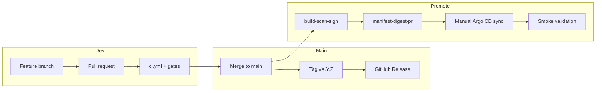

# Release strategy — boutique-gke-sre

Canonical release engineering guide for the production SRE reference platform.

| Item               | Value                                                                      |
| ------------------ | -------------------------------------------------------------------------- |
| **Repository**     | `boutique-gke-sre`                                                         |
| **Default branch** | `main`                                                                     |
| **Deploy model**   | GitOps + manual Argo CD sync ([ADR-003](../adr/003-manual-argocd-sync.md)) |
| **Public URLs**    | https://boutique.biroltilki.art · https://argocd.boutique.biroltilki.art   |

**Related:** [UPGRADE.md](UPGRADE.md) · [MIGRATION.md](MIGRATION.md) · [operations/rollback.md](../operations/rollback.md) · [CONTRIBUTING.md](../../CONTRIBUTING.md)

---

## Release workflow

### Purpose

Define how changes move from development to a tagged, documented, validated production release without bypassing supply-chain or GitOps controls.

### Overview



### Release types

| Type                 | Branch source                | Tag example    | Deploy                                      |
| -------------------- | ---------------------------- | -------------- | ------------------------------------------- |
| **Continuous**       | `main`                       | None (rolling) | Digest PR + manual sync                     |
| **Platform release** | `main` or `release/vX.Y`     | `v1.2.0`       | Tag documents point-in-time; operator syncs |
| **Hotfix**           | `release/v1.2` → cherry-pick | `v1.2.1`       | Fast-track digest + sync                    |
| **Infra release**    | `main` + Terraform PR        | `v1.2.0`       | `terraform apply` then GitOps               |

### Standard platform release (step-by-step)

1. **Freeze scope** — confirm error budget and change window ([error-budget-policy.md](../sre/error-budget-policy.md))
2. **Merge** all release PRs to `main`; CI green (`ci.yml`, `terraform-plan.yml` if applicable)
3. **Image rebuild** (if upstream bump): GitHub Actions → `build-scan-sign` → merge digest PR
4. **Tag** `vX.Y.Z` on `main` (or merge `release/vX.Y` then tag)
5. **GitHub Release** — workflow `.github/workflows/release.yml` or manual from template
6. **Operator promote:**
   - `argocd app sync policies` (if changed)
   - `argocd app sync observability` (if changed)
   - `argocd app sync boutique`
   - `terraform apply` (if infra changed)
7. **Post-release verification** — smoke checklist + alert spot-check
8. **Announce** — internal handoff; update roadmap if phase milestone

### Commands

```bash
# Pre-release validation
make validate
make runbook-lint

# Tag (release manager)
git fetch origin main
git checkout main
git pull
git tag -a v1.0.0 -m "boutique-gke-sre v1.0.0 — Phase 7 complete"
git push origin v1.0.0

# Operator deploy at tag
git checkout v1.0.0
argocd app sync boutique --prune
curl -I https://boutique.biroltilki.art
```

### Validation

- CI green on commit tagged
- GitHub Release published with notes
- Smoke validation passes post-sync

### Expected outcome

- `main` at release commit; tag immutable
- Cluster state matches Git at tag (after manual sync)
- Release notes document image digests and breaking changes

### Recovery steps

Failed release → [Rollback strategy](#rollback-strategy)

### Best practices

- Never tag a red CI commit
- Release notes always list Online Boutique `upstream_version` and chart version
- Platform releases are documentation + Git pointers; cluster promotion remains operator-driven

---

## Versioning strategy

### Purpose

Separate version concerns so supply chain, platform config, and application images remain auditable.

### Version layers

| Layer               | What is versioned       | Where                             | Example                                  |
| ------------------- | ----------------------- | --------------------------------- | ---------------------------------------- |
| **Platform**        | Entire repo reference   | Git tag SemVer                    | `v1.2.0`                                 |
| **Helm chart**      | Boutique packaging      | `gitops/apps/boutique/Chart.yaml` | `0.2.0`                                  |
| **App upstream**    | Online Boutique release | CI `upstream_version`             | `v0.10.5`                                |
| **Images**          | Immutable deploy unit   | `values-images.yaml` `@sha256:`   | per-service digest                       |
| **Terraform**       | Infra modules           | Git + state                       | no separate semver (tracks platform tag) |
| **Platform images** | OTel, Grafana mirrors   | `mirror-platform-images` workflow | digest in observability manifests        |

### Rules

1. **Production deploys use digests**, not mutable tags ([Kyverno require-digest](../gitops/policies/kyverno/require-digest.yaml))
2. **Platform SemVer tag** marks a supported, documented, smoke-validated snapshot
3. **Chart `version`** bumps on Helm template or values schema changes
4. **Chart `appVersion`** reflects Online Boutique upstream tag (informational)
5. **CI records** upstream tag in AR as `europe-west1-docker.pkg.dev/boutique-gke/boutique/<svc>:<tag>`; Git records digest

### Validation

```bash
grep '^version:' gitops/apps/boutique/Chart.yaml
grep 'upstream_version' .github/workflows/build-scan-sign.yml
git tag -l 'v*' | tail -5
```

### Expected outcome

Every production incident can answer: platform tag, chart version, upstream version, and image digests.

### Best practices

- Bump chart `version` in the same PR as breaking Helm changes
- Record all layers in GitHub Release notes

---

## Semantic Versioning

### Purpose

Communicate change impact using [SemVer 2.0.0](https://semver.org/).

### Scheme: `vMAJOR.MINOR.PATCH`

| Bump      | When                                         | Examples                                                                                     |
| --------- | -------------------------------------------- | -------------------------------------------------------------------------------------------- |
| **MAJOR** | Breaking platform change; migration required | GKE networking redesign, Kyverno policy that rejects existing manifests, DNS hostname change |
| **MINOR** | New capability; backward compatible          | New runbook, SLO, game day, observability dashboard, optional Terraform module               |
| **PATCH** | Fixes; docs; non-breaking tuning             | Runbook fix, alert threshold tune, doc correction                                            |

### Pre-release tags (optional)

| Tag              | Meaning                                                   |
| ---------------- | --------------------------------------------------------- |
| `v1.1.0-rc.1`    | Release candidate; smoke on staging or maintenance window |
| `v1.1.0-alpha.1` | Experimental; not for production sync                     |

This reference uses **stable tags only** on `main` unless explicitly testing RC.

### Application images (not platform SemVer)

Online Boutique upstream uses **its own** tags (`v0.10.5`). Platform release notes **reference** upstream version; they do not replace it.

### Validation

Release notes section **Breaking changes** empty for PATCH; populated for MAJOR.

### Best practices

- When in doubt between MINOR and MAJOR, choose MAJOR and document migration
- Align first production tag with smoke-validation gate (e.g. `v1.0.0` = production bar met)

---

## Release branches

### Purpose

Support parallel hotfix lines without blocking `main` development.

### Branch model

```
main ─────●─────●─────●─────●─────► (continuous integration)
           \           \
            \           └── release/v1.1 ──●── v1.1.1 (hotfix)
             \
              └── release/v1.0 ──●── v1.0.1 (hotfix, EOL)
```

| Branch         | Created from        | Merges to                  | Lifetime           |
| -------------- | ------------------- | -------------------------- | ------------------ |
| `main`         | —                   | —                          | Permanent          |
| `release/vX.Y` | `main` at RC/freeze | `main` (back-merge) + tags | Until `vX.Y.*` EOL |
| `hotfix/*`     | `release/vX.Y`      | `release/vX.Y` → `main`    | Delete after merge |

### When to create `release/vX.Y`

- Patch series expected (`v1.2.1`, `v1.2.2`)
- Long stabilization before `vX.(Y+1).0`
- Portfolio demo frozen at `v1.0` while `main` advances

### Commands

```bash
# Create release branch
git checkout main && git pull
git checkout -b release/v1.2
git push -u origin release/v1.2

# Hotfix on release branch
git checkout release/v1.2
git checkout -b hotfix/v1.2.1-redis-probe
# ... fix, PR to release/v1.2 ...
git tag v1.2.1
git push origin v1.2.1

# Back-merge to main
git checkout main
git merge release/v1.2
git push origin main
```

### Validation

Hotfix tag commit exists on both `release/vX.Y` and `main` (after back-merge).

### Best practices

- Single maintainer tags releases (or GitHub Environment protection)
- Delete stale `release/v*` branches after EOL announced in release notes

---

## Tagging

### Purpose

Immutable Git references for audit, rollback, and GitHub Releases.

### Tag format

```
v<MAJOR>.<MINOR>.<PATCH>[-<pre-release>]
```

Examples: `v1.0.0`, `v1.2.3`, `v2.0.0-rc.1`

### Commands

```bash
# Annotated tag (preferred)
git tag -a v1.0.0 -m "boutique-gke-sre v1.0.0

- Phase 7 smoke validation complete
- Online Boutique v0.10.5
- SLOs + PagerDuty live"

git push origin v1.0.0

# List tags
git tag -l 'v*' --sort=-v:refname

# Checkout release
git checkout v1.0.0
```

### Validation

```bash
git rev-parse v1.0.0^{commit}
git log -1 --oneline v1.0.0
```

### Expected outcome

Tag points to CI-green commit; GitHub Release attached to same tag.

### Best practices

- Use annotated tags only (not lightweight)
- Never move or force-push tags on `main`
- Sign tags with GPG if org policy requires (optional for portfolio)

---

## Release notes

### Purpose

Communicate change impact to operators, reviewers, and future on-call engineers.

### Structure

Use [RELEASE_NOTES_TEMPLATE.md](RELEASE_NOTES_TEMPLATE.md). GitHub Release sections:

1. **Highlights** — 3–5 bullets
2. **Application images** — upstream version + digest table
3. **Platform changes** — GitOps, policies, observability
4. **Infrastructure** — Terraform delta + apply required yes/no
5. **Security & supply chain** — Trivy, cosign, Binary Auth
6. **SRE** — SLO, alert, runbook changes
7. **Breaking changes** — link [MIGRATION.md](MIGRATION.md)
8. **Known issues**
9. **Upgrade** — link [UPGRADE.md](UPGRADE.md)
10. **Rollback** — previous tag

### Commands

```bash
# Generate compare URL for changelog
gh release create v1.0.0 \
  --title "boutique-gke-sre v1.0.0" \
  --notes-file docs/release/RELEASE_NOTES_TEMPLATE.md \
  --verify-tag

# Or auto via release workflow on tag push
```

### Validation

- Every alert policy change mentions runbook URL
- Breaking section matches actual migration steps
- Image table matches `values-images.yaml` at tag

### Best practices

- Write for operators executing sync, not only developers
- Include `make runbook-lint` result for SRE-heavy releases

---

## Upgrade guide

### Purpose

Operator-facing steps to apply a release. Full detail: **[UPGRADE.md](UPGRADE.md)**.

### Summary

| Step | Action                                   |
| ---- | ---------------------------------------- |
| 1    | Review release notes + error budget      |
| 2    | Merge digest PR (if images rebuilt)      |
| 3    | `terraform apply` (if infra changed)     |
| 4    | Sync policies → observability → boutique |
| 5    | Smoke validation                         |

### Commands

```bash
# See UPGRADE.md for full procedure
argocd app sync boutique --prune
curl -I https://boutique.biroltilki.art
```

### Validation

[16-smoke-validation.md](../setup/16-smoke-validation.md) passes.

### Recovery steps

→ [Rollback strategy](#rollback-strategy)

### Best practices

- Sync order: policies before application
- Never skip smoke validation for MINOR/MAJOR

---

## Migration guide

### Purpose

Document breaking changes requiring more than sync. Full detail: **[MIGRATION.md](MIGRATION.md)**.

### When required

- MAJOR platform release
- Kyverno policy tightening
- Cosign / Binary Authorization rotation
- Upstream image path or version breaking change

### Validation

Migration section includes commands and expected output.

### Best practices

- One migration section per breaking release; never delete from git history

---

## Rollback strategy

### Purpose

Restore last known-good state quickly after a bad release.

### Rollback layers

| Layer           | Method                                                       | RTO     |
| --------------- | ------------------------------------------------------------ | ------- |
| **Application** | Git revert digest / checkout previous tag + Argo sync        | Minutes |
| **Platform**    | Argo history rollback (emergency) + Git revert               | Minutes |
| **Terraform**   | Revert TF PR + `terraform apply`                             | Hours   |
| **Images**      | Previous digests in `values-images.yaml` at tag `vX.Y.(Z-1)` | Minutes |

### Commands

```bash
# Preferred: revert to previous platform tag
git checkout v1.0.0   # last good
# Or revert commit on main
git revert <bad-sha>

argocd app sync boutique --prune
kubectl get pods -n boutique
curl -I https://boutique.biroltilki.art
```

### Validation

- SLO burn stops
- Storefront HTTP 200
- No CrashLoopBackOff in `boutique` namespace

### Expected outcome

Service restored; Git matches cluster; incident documented.

### Recovery steps

If rollback fails → [bad-deploy-rollback.md](../sre/runbooks/bad-deploy-rollback.md)

### Best practices

- Git revert is source of truth over Argo UI rollback
- Keep previous tag documented in release notes for one-click rollback

→ [operations/rollback.md](../operations/rollback.md)

---

## Compatibility considerations

### Purpose

Prevent version skew between cluster, platform charts, and application images.

### Matrix

| Component           | Current baseline                | Notes                                           |
| ------------------- | ------------------------------- | ----------------------------------------------- |
| **GKE**             | 1.28+ (`REGULAR` channel)       | Upgrade control plane before nodes              |
| **Terraform**       | ≥ 1.5                           | `make validate` in CI                           |
| **Helm**            | 3.16+                           | Chart rendering in CI                           |
| **Online Boutique** | v0.10.5                         | `us-central1-docker.pkg.dev/google-samples/...` |
| **Redis**           | 7.2-alpine                      | `redis-cart` service                            |
| **Argo CD**         | Pinned in bootstrap Helm values | Manual sync only                                |
| **Kyverno**         | 5 cluster policies minimum      | Tests in `tests/kyverno/`                       |
| **cosign**          | Key in GSM + TF Binary Auth     | Rotation = migration event                      |

### Skew rules

- **Digest in Git** must exist in Artifact Registry and pass Binary Authorization
- **Kyverno policies** must pass before new workload shapes deploy
- **Terraform** cluster version must support current GKE APIs
- **SLO queries** must match metric descriptors after observability changes

### Validation

```bash
make validate
./tests/manifest/digest-only.sh
kubectl version
```

### Best practices

- Update compatibility matrix in [MIGRATION.md](MIGRATION.md) on each MINOR+ release
- Run game day after GKE minor bump

---

## Known issues

### Purpose

Transparent tracking of limitations not fixed in current release.

### Current (update per release)

| Issue                      | Impact                | Workaround                                  | Target fix           |
| -------------------------- | --------------------- | ------------------------------------------- | -------------------- |
| GKE Backup module scaffold | DR drill manual       | Documented scripts; Phase 8                 | v1.1.0               |
| Burn-rate 3d window        | API 24h max           | Use 24h/1× for slow burn                    | Documented           |
| Single cluster             | No env isolation      | Namespace boundaries                        | ADR-001              |
| Upstream CVEs              | Trivy baseline ignore | `.github/trivy/upstream-mirror.trivyignore` | Per upstream release |

### Validation

Known issues section in GitHub Release matches this table or documents "None."

### Best practices

- Link GitHub issues; remove from table when fixed in a tagged release

---

## Breaking changes

### Purpose

Explicit list of changes that require migration or cause deploy failure.

### Policy

- **PATCH:** no breaking changes
- **MINOR:** breaking changes avoided; if unavoidable, treat as MAJOR
- **MAJOR:** migration guide required

### Examples (historical / reference)

| Change                    | Version      | Migration                    |
| ------------------------- | ------------ | ---------------------------- |
| Manual Argo sync required | v1.0.0+      | ADR-003; disable auto-sync   |
| Digest-only images        | v1.0.0+      | Kyverno rejects tags         |
| ESO-only secrets          | v1.0.0+      | No plain Secret resources    |
| Obsolete GCR image paths  | v0.10.5 bump | [MIGRATION.md](MIGRATION.md) |

### Validation

`make validate` and Kyverno tests pass on release tag without bypass flags.

### Best practices

- Announce breaking changes in PR description before tag
- Provide rollback path in same release notes

---

## Validation checklist

Pre-tag technical validation (automated + manual).

### Automated (CI)

- [ ] `ci.yml` — Terraform fmt/validate, Kyverno tests, kubeconform, digest-only
- [ ] `terraform-plan.yml` — no unexpected destroy (if TF changed)
- [ ] `make runbook-lint` — alert ↔ runbook linkage
- [ ] `pre-commit` — gitleaks, yaml lint

### Manual (operator)

- [ ] `curl -I https://boutique.biroltilki.art` — 200/302
- [ ] `curl -I https://argocd.boutique.biroltilki.art` — 200/302
- [ ] Argo CD apps Healthy/Synced
- [ ] Five Kyverno policies active
- [ ] SLOs reporting in Cloud Monitoring
- [ ] PagerDuty test alert within last 90 days
- [ ] [16-smoke-validation.md](../setup/16-smoke-validation.md) checklist

### Commands

```bash
make validate
curl -I https://boutique.biroltilki.art
kubectl get clusterpolicy | wc -l
```

### Expected outcome

All automated checks green; manual smoke documented in release PR.

---

## Release checklist

Release manager checklist before tagging.

### Planning

- [ ] Release scope agreed (MAJOR/MINOR/PATCH)
- [ ] Error budget > 25% or exception documented
- [ ] Maintenance window scheduled (if MAJOR or infra)
- [ ] [MIGRATION.md](MIGRATION.md) updated (if breaking)

### Code & CI

- [ ] All PRs merged; `main` green
- [ ] Chart `version` bumped (if Helm changed)
- [ ] Runbooks updated for alert changes
- [ ] Setup guides updated for operator step changes

### Images (if applicable)

- [ ] `build-scan-sign` green for target `upstream_version`
- [ ] Digest PR merged
- [ ] Trivy baseline reviewed

### Tag & document

- [ ] Annotated tag `vX.Y.Z` on correct commit
- [ ] GitHub Release published from [template](RELEASE_NOTES_TEMPLATE.md)
- [ ] Compatibility matrix updated

### Promote (operator)

- [ ] Terraform applied (if required)
- [ ] Argo CD sync: policies → observability → boutique
- [ ] Post-release verification complete

### Close

- [ ] Release announced / handoff logged
- [ ] Previous release tag noted for rollback
- [ ] Known issues table updated

---

## Post-release verification

### Purpose

Confirm the live environment matches the tagged release.

### Commands

```bash
# Version traceability
git describe --tags
grep '@sha256:' gitops/apps/boutique/values-images.yaml | head -3

# Health
curl -I https://boutique.biroltilki.art
kubectl get pods -n boutique
kubectl -n argocd get applications

# SRE
gcloud monitoring policies list --project=boutique-gke \
  --format='table(displayName,enabled)' | head -10
make runbook-lint
```

### Validation

| Check      | Expected                                       |
| ---------- | ---------------------------------------------- |
| Storefront | HTTP 200/302                                   |
| Argo CD    | `boutique` Healthy + Synced                    |
| Pods       | All Running/Ready in `boutique`                |
| Alerts     | Policies enabled; no unexpected OPEN incidents |
| SLOs       | Reporting; no unexplained burn                 |

### Expected outcome

Production bar maintained; release recorded in handoff log.

### Recovery steps

Failure → rollback to `vX.Y.(Z-1)` per [Rollback strategy](#rollback-strategy)

### Best practices

- Monitor for 30 minutes post-sync (checkout path)
- Watch burn-rate alerts during rollout

---

## CI/CD release automation

### Purpose

Automate validation and GitHub Release creation; **not** auto-deploy to cluster (ADR-003).

### Workflows

| Workflow                                                                 | Trigger           | Release role        |
| ------------------------------------------------------------------------ | ----------------- | ------------------- |
| [ci.yml](../../.github/workflows/ci.yml)                                 | PR + push `main`  | Quality gate        |
| [terraform-plan.yml](../../.github/workflows/terraform-plan.yml)         | PR `terraform/**` | Infra review        |
| [build-scan-sign.yml](../../.github/workflows/build-scan-sign.yml)       | Manual dispatch   | Image supply chain  |
| [manifest-digest-pr.yml](../../.github/workflows/manifest-digest-pr.yml) | After build       | Digest promotion PR |
| [release.yml](../../.github/workflows/release.yml)                       | Push tag `v*`     | GitHub Release      |

### Release pipeline

```
PR → ci.yml (+ terraform-plan) → merge main
  → (optional) build-scan-sign → manifest-digest-pr → merge
  → tag vX.Y.Z → release.yml → GitHub Release
  → operator: manual Argo CD sync + smoke
```

### Commands

```bash
# Trigger image pipeline for release
gh workflow run build-scan-sign.yml \
  -f upstream_version=v0.10.5 \
  -f redis_tag=7.2-alpine

# Create release (after tag push — or workflow creates on tag)
git push origin v1.0.0
```

### Validation

```bash
gh run list --workflow=release.yml --limit 3
gh release view v1.0.0
```

### Expected outcome

GitHub Release artifact exists; cluster promotion remains operator-controlled.

### Best practices

- Protect `main` and tag creation with branch protection / environments
- Release workflow must not contain cluster credentials or auto-sync

---

## GitHub Releases structure

### Purpose

Standardize release artifacts on GitHub for portfolio and operator consumption.

### Release metadata

| Field           | Value                               |
| --------------- | ----------------------------------- |
| **Tag**         | `vX.Y.Z`                            |
| **Target**      | `main` (or `release/vX.Y`)          |
| **Title**       | `boutique-gke-sre vX.Y.Z`           |
| **Pre-release** | Check for `-rc`, `-alpha` tags only |

### Body sections (order)

1. Highlights
2. Application images (upstream + digests)
3. Platform changes
4. Infrastructure (Terraform)
5. Security & supply chain
6. SRE & observability
7. Breaking changes
8. Known issues
9. Upgrade → link `docs/release/UPGRADE.md`
10. Rollback → previous tag

### Assets (optional)

| Asset                               | When          |
| ----------------------------------- | ------------- |
| `values-images.yaml` snapshot       | Image release |
| Terraform plan summary              | Infra release |
| Smoke validation checklist (PDF/md) | MAJOR         |

### Example release title series

```
boutique-gke-sre v1.0.0 — Production bar (smoke validation)
boutique-gke-sre v1.1.0 — Backup/restore + Phase 8
boutique-gke-sre v1.1.1 — Hotfix: uptime alert tuning
```

### Validation

```bash
gh release list --limit 5
```

### Best practices

- Use `generate_release_notes: false` and curated template for educational clarity
- Link to compare view: `https://github.com/btilki/boutique-gke-sre/compare/v1.0.0...v1.1.0`

---

## Document history

| Version | Date       | Notes                    |
| ------- | ---------- | ------------------------ |
| 1.0     | 2026-07-04 | Initial release strategy |
