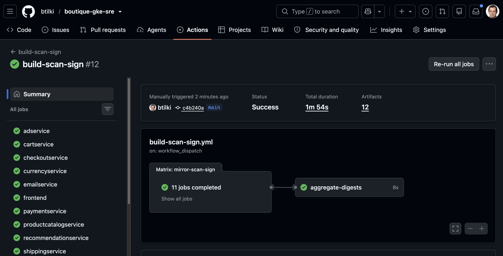
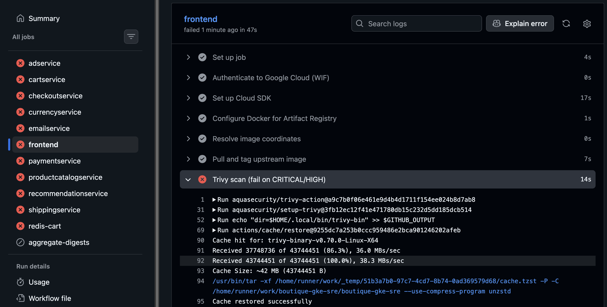
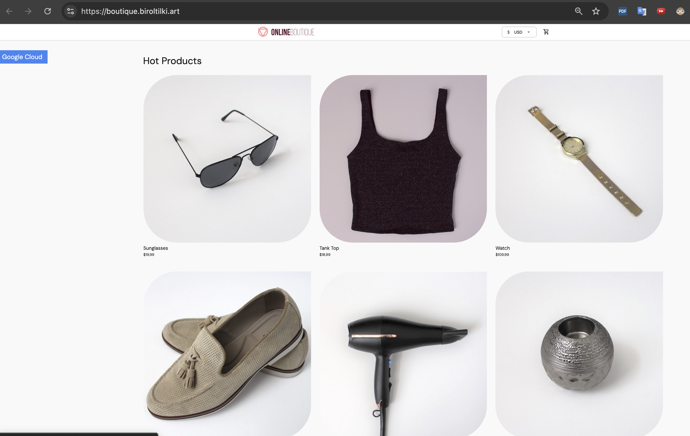

# Online Boutique deploy

## Goal

Deploy Google Online Boutique to the `boutique` namespace via Argo CD **manual sync**, using digest-pinned images from `gitops/apps/boutique/values-images.yaml`, and confirm the storefront responds at **`boutique.biroltilki.art`**. All Kyverno policies and Binary Authorization checks must pass during sync.

## Why this step is required

This is the first full application workload on the production-ready platform (Phase 4 gate complete). It validates the entire supply chain built in topics 07–11:

- CI promotes image **digests** (not tags) into `values-images.yaml`
- Argo CD renders the Helm chart in `gitops/apps/boutique/`
- Kyverno enforces probes, resources, digests, and labels
- Binary Authorization verifies signed images at deploy time
- ESO pattern is ready for any application secrets

Manual sync ensures a human explicitly promotes each revision after PR review.

## Prerequisites

- Prior guides through [11-kyverno-policies.md](11-kyverno-policies.md) — **Phase 4 gate complete**
- **Scaffold gate:** `gitops/apps/boutique/templates/` must contain Helm templates and `values-images.yaml` must have uncommented digest pins before sync succeeds
- Artifact Registry images built and signed (topic 08); digests recorded in `values-images.yaml`
- Argo CD CLI logged in or UI access at `argocd.boutique.biroltilki.art`
- `boutique` namespace labeled: `network-policy.biroltilki.art/tier=application` (topic 11; Argo CD also applies via `managedNamespaceMetadata` on sync)
- NetworkPolicies applied from topic 11, including [`gitops/policies/network-policies/boutique-frontend-ingress.yaml`](../../gitops/policies/network-policies/boutique-frontend-ingress.yaml) (frontend pods must have label `app: frontend`)
- Tools: `kubectl`, `argocd` CLI, `curl`, `dig`, `helm`; optional: `kyverno` CLI, `kubeconform` (for `./tests/manifest/` scripts in step 2)

## Commands

### 0. Bootstrap images (first deploy only)

On the **first** Boutique deploy, mirror upstream images into Artifact Registry and record digests via CI — do not hand-edit digests or pull from deprecated registries.

| Image set        | Upstream source                                                                                                |
| ---------------- | -------------------------------------------------------------------------------------------------------------- |
| 10 microservices | `us-central1-docker.pkg.dev/google-samples/microservices-demo/<service>:v0.10.5` (e.g. `.../frontend:v0.10.5`) |
| `redis-cart`     | `docker.io/library/redis:7.2-alpine`                                                                           |

**Do not use** `gcr.io/google-samples/microservices-demo` or tag `v0.10.2` — those paths are obsolete and will fail image pull.

#### Run the CI mirror pipeline

1. Confirm GitHub Secrets from topic 07–08: `GCP_WORKLOAD_IDENTITY_PROVIDER`, `GCP_SERVICE_ACCOUNT`, `COSIGN_PRIVATE_KEY`, `COSIGN_PASSWORD`
2. GitHub → **Actions** → **build-scan-sign** → **Run workflow**
3. Leave defaults unless intentionally upgrading:
   - `upstream_version`: `v0.10.5`
   - `redis_tag`: `7.2-alpine`
4. Wait for all 11 matrix jobs to succeed (mirror → Trivy → push → cosign sign/attest)



The workflow mirrors from the upstream table above into:

```text
europe-west1-docker.pkg.dev/boutique-gke/boutique/<service>:<tag>
```

#### Trivy baseline for upstream mirrors

Third-party images may report known CVEs that upstream has not patched. The mirror workflow uses [`.github/trivy/upstream-mirror.trivyignore`](../../.github/trivy/upstream-mirror.trivyignore) as a documented accepted-risk baseline — see [`.github/trivy/README.md`](../../.github/trivy/README.md) for review policy.

Regenerate the ignore file when `upstream_version` or `redis_tag` changes.

Without an accepted-risk baseline, Trivy fails the matrix on known upstream CVEs:



#### Digest promotion PR

After a green `build-scan-sign` run, **manifest-digest-pr** opens (or updates) a PR that writes digests into `gitops/apps/boutique/values-images.yaml`.

1. Review the PR — confirm every image uses `@sha256:` pins
2. Merge to `main`
3. Continue with step 1 below

**Re-deploys:** skip this section; merge new digest PRs from CI after image rebuilds only.

### 1. Verify digest-only image values

Open `gitops/apps/boutique/values-images.yaml`. Every image must use a digest pin — never `:latest`:

```yaml
# Example structure (replace digests with values from CI / Artifact Registry)
images:
  frontend:
    repository: europe-west1-docker.pkg.dev/boutique-gke/boutique/frontend
    digest: sha256:abc123...
```

Confirm no floating tags (CI parity):

```bash
./tests/manifest/digest-only.sh
```

### 2. Local render check (optional, before sync)

Same command CI runs in `tests/manifest/kubeconform.sh`:

```bash
helm template boutique gitops/apps/boutique/ \
  -f gitops/apps/boutique/values.yaml \
  -f gitops/apps/boutique/values-images.yaml \
  | head -50

# Full schema validation (requires kubeconform + helm)
./tests/manifest/kubeconform.sh

# Digest-only pins and Kyverno admission (requires kyverno CLI)
./tests/manifest/digest-only.sh
./tests/manifest/boutique-kyverno.sh
```

Dry-run against the API server to catch Kyverno denials early:

```bash
helm template boutique gitops/apps/boutique/ \
  -f gitops/apps/boutique/values.yaml \
  -f gitops/apps/boutique/values-images.yaml \
  | kubectl apply --dry-run=server -f -
```

### 3. Ensure the Argo CD Application exists

Sync the root app-of-apps if the `boutique` Application is not yet visible:

```bash
argocd app sync boutique-root
argocd app list | grep boutique
```

The Application manifest is `gitops/apps/argocd-apps/boutique-application.yaml`.

### 4. Manual sync the Boutique application

```bash
argocd app diff boutique
argocd app sync boutique --prune
argocd app wait boutique --health --timeout 600
```

In the Argo CD UI: Applications → `boutique` → **Sync** → select resources → **Synchronize** (no auto-sync).

### 5. Watch rollout

```bash
kubectl -n boutique get pods -w
```

Wait until all pods are `Running` and readiness probes pass.

### 6. Verify Ingress for the storefront

```bash
kubectl -n boutique get ingress
kubectl -n boutique describe ingress
```

The boutique Ingress must reference the **`boutique-ingress-ip`** static IP (distinct from `argocd-ingress-ip` used in topic 09) and a Google-managed certificate for `boutique.biroltilki.art` (configured in Helm templates — see `gitops/apps/boutique/templates/`).

## Expected output

- `argocd app sync boutique` completes with `Sync Status: Synced`, `Health: Healthy`
- `kubectl -n boutique get pods` — **11/11** pods `Running`, `READY 1/1` (10 microservices + `redis-cart`)
- `kubectl -n boutique get managedcertificate` — certificate status **Active**
- `kubectl -n boutique get svc,ingress` — frontend Service and Ingress present
- `curl -I `boutique.biroltilki.art`` returns `HTTP/2 200`
- Browsing the URL in a browser shows the Online Boutique storefront



## Validation

```bash
# Digest-only image values (CI parity)
./tests/manifest/digest-only.sh

# Kyverno admission on rendered chart (optional; requires kyverno CLI)
./tests/manifest/boutique-kyverno.sh

# DNS points at the boutique static ingress IP
dig +short boutique.biroltilki.art

# Storefront HTTPS healthy
curl -I https://boutique.biroltilki.art

# Argo CD application healthy
argocd app get boutique

# All pods ready (expect 11)
kubectl -n boutique get pods

# TLS certificate active
kubectl -n boutique get managedcertificate

# Images use digests (spot-check frontend)
kubectl -n boutique get pod -l app=frontend -o jsonpath='{.items[0].spec.containers[0].image}'
# Expected: ...@sha256:...

# Kyverno did not audit-fail (optional)
kubectl get policyreport -n boutique
```

**Pass criteria:** Storefront loads over HTTPS; 11/11 pods Running; ManagedCertificate Active; Argo CD `boutique` app Synced/Healthy; images show `@sha256:` digests.

## Common problems

| Symptom                          | Cause                                 | Fix                                                                                                                                                                                       |
| -------------------------------- | ------------------------------------- | ----------------------------------------------------------------------------------------------------------------------------------------------------------------------------------------- |
| CI Trivy fails on upstream CVEs  | New version or expanded CVE database  | Review logs; update `.github/trivy/upstream-mirror.trivyignore` per README                                                                                                                |
| `build-scan-sign` image pull 404 | Wrong upstream registry/tag           | Use `us-central1-docker.pkg.dev/google-samples/microservices-demo/<service>:v0.10.5`, not `gcr.io`                                                                                        |
| No digest PR after CI green      | `manifest-digest-pr` not triggered    | Confirm `build-scan-sign` completed; check Actions tab for workflow_run failure                                                                                                           |
| Sync failed — Kyverno denied     | Missing probes, resources, or digest  | Fix Helm templates or values; re-run dry-run                                                                                                                                              |
| `ImagePullBackOff`               | Wrong digest or missing AR permission | Verify digest in AR; check node SA has `artifactregistry.reader`                                                                                                                          |
| Binary Authorization blocked     | Image not signed / attestor mismatch  | Re-run CI sign+attest; verify policy in topic 08                                                                                                                                          |
| `OutOfSync` loop                 | Helm hooks or ignored differences     | Check `argocd app diff`; add ignoreDifferences if intentional                                                                                                                             |
| 502 / storefront timeout         | Cert not Active, DNS wrong, or NetPol | Check `ManagedCertificate` Active; `dig` vs `boutique-ingress-ip`; apply `gitops/policies/network-policies/boutique-frontend-ingress.yaml`; verify `app: frontend` on frontend Deployment |
| Cart/checkout errors             | NetworkPolicy too restrictive         | Confirm all NetPol files synced; `app.kubernetes.io/part-of: boutique` on all pods                                                                                                        |

## Recovery

- **Rollback via Git:** revert the digest PR in GitHub, merge, then `argocd app sync boutique`
- **Rollback via Argo CD history:** `argocd app rollback boutique <revision-id>`
- **Delete failed sync:** `argocd app sync boutique --force` only after fixing root cause
- **Full app removal:** `argocd app delete boutique` (does not remove namespace by default)

See runbook [bad-deploy-rollback.md](../sre/runbooks/bad-deploy-rollback.md) for incident-style rollback.

## Best practices

- Every image change flows: CI build → Trivy scan → cosign sign → digest PR → review → manual Argo sync
- Never hand-edit running deployments — change Git and sync
- Run `argocd app diff` before every production sync
- Keep `values.yaml` (config) and `values-images.yaml` (digests) separate for clean CI automation
- Smoke-test checkout path after deploy, not just the homepage

## Security notes

- Digest-only images prevent silent tag overwrites in the registry
- Binary Authorization is the last line of defense if a malicious digest is merged
- NetworkPolicies limit east-west traffic between microservices
- No application secrets in Helm values — use ESO `ExternalSecret` CRs
- Storefront is public by design; admin interfaces (Argo CD) should have additional access controls

## Next step

→ [Observability + SLOs](13-observability-slos.md)
