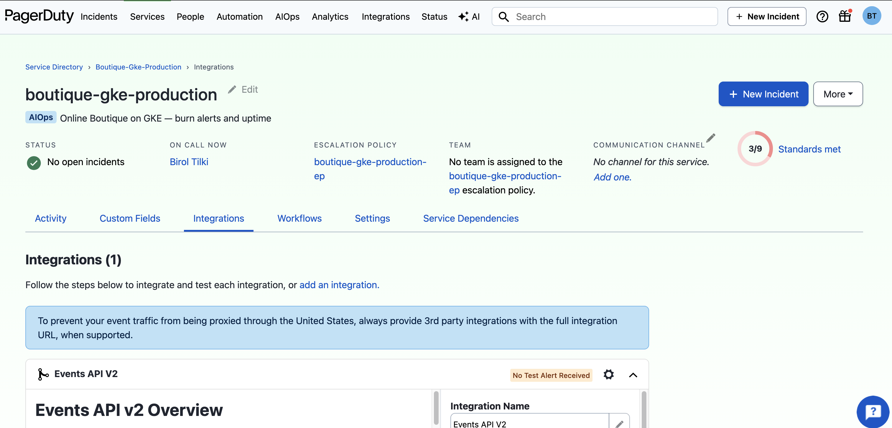

# PagerDuty integration

## Goal

Connect Cloud Monitoring alert policies to **PagerDuty** via an Events API v2 integration, create a GCP notification channel, attach it to burn-rate and uptime alert policies, and fire a **test incident** to confirm end-to-end on-call routing. Document the procedure in [test-alerts.md](../sre/oncall/test-alerts.md).

## Why this step is required

SLO burn alerts and uptime failures are useless if nobody is paged. PagerDuty provides escalation, acknowledgement, and incident history. Cloud Monitoring notification channels bridge GCP alerts to PagerDuty services.

This topic completes the alerting path started in topic 13:

```
SLI → SLO → burn-rate alert policy → notification channel → PagerDuty → on-call engineer → runbook
```

Without a tested integration, the first real outage may be the first time you discover a misconfigured integration key.

## Prerequisites

- Prior guide: [13-observability-slos.md](13-observability-slos.md)
- SLOs and alert policies created (browse/checkout burn, uptime check)
- PagerDuty account with permission to create services and integrations
- **PagerDuty signup email:** use a **domain/work address** (e.g. `you@biroltilki.art`). Consumer Gmail is often blocked on trial signup. If DNS for your domain uses **Google Cloud DNS**, configure MX/SPF/DKIM for outbound mail before signup (Namecheap Private Email or similar).
- Tools: `gcloud`, `curl`, browser access to GCP Console and PagerDuty
- Mobile device with PagerDuty app configured for push notifications

## Commands

### 1. Create a PagerDuty service

**PagerDuty UI → Services → Service Directory → + New Service**

| Field             | Value                                           |
| ----------------- | ----------------------------------------------- |
| Name              | `boutique-gke-production`                       |
| Description       | Online Boutique on GKE — burn alerts and uptime |
| Escalation policy | Your on-call rotation (create if needed)        |
| Alert grouping    | Intelligent (recommended)                       |

Save the service.

### 2. Add Events API v2 integration

**Service → Integrations → Add an integration**

| Field            | Value                      |
| ---------------- | -------------------------- |
| Integration type | **Events API V2** (not v1) |
| Name             | `Google Cloud Monitoring`  |

**Important:** During service creation, PagerDuty may offer **Events API v1** and **Events API V2**. Google Cloud Monitoring requires **V2 only**. Remove v1 if selected by mistake.

If you added the integration during the service wizard, verify the type is **Events API V2** before copying the key.



Copy the **Integration Key** (32-character hex string). Store it in Secret Manager — do not commit to Git. Use a prompt so the key is not stored in shell history:

```bash
gcloud config set project boutique-gke

read -s PD_KEY
echo -n "$PD_KEY" | gcloud secrets create pagerduty-integration-key \
  --project=boutique-gke \
  --replication-policy=automatic \
  --data-file=-
unset PD_KEY
```

If the secret already exists, add a new version instead:

```bash
read -s PD_KEY
echo -n "$PD_KEY" | gcloud secrets versions add pagerduty-integration-key --data-file=-
unset PD_KEY
```

### 3. Create Cloud Monitoring notification channel

**GCP Console → Monitoring → Alerting → Edit notification channels → PagerDuty**

| Field        | Value                           |
| ------------ | ------------------------------- |
| Channel type | PagerDuty                       |
| Service key  | Integration key from step 2     |
| Display name | `pagerduty-boutique-production` |

Click **Test connection** if available. Save the channel.

List channels (verify creation):

```bash
curl -s -H "Authorization: Bearer $(gcloud auth print-access-token)" \
  "https://monitoring.googleapis.com/v3/projects/boutique-gke/notificationChannels" \
  | python3 -c "import sys,json; [print(c['displayName'], c['type'], c.get('enabled')) for c in json.load(sys.stdin).get('notificationChannels',[])]"
```

### 4. Attach channel to alert policies

**Option A — GCP Console (manual)**

For each production alert policy from topic 13:

**Monitoring → Alerting → [policy name] → Edit → Notifications → Add notification channel**

**Option B — Script (recommended)**

From the repo root (requires GSM secret from step 2; creates channel if missing):

```bash
cd /path/to/boutique-gke-sre
./scripts/attach-pagerduty-channel.sh
```

If you see `permission denied`, run `bash scripts/attach-pagerduty-channel.sh` or `chmod +x scripts/attach-pagerduty-channel.sh`.

Attach `pagerduty-boutique-production` to:

| Policy                       | Runbook                                                                        |
| ---------------------------- | ------------------------------------------------------------------------------ |
| `browse-availability-burn`   | [browse-availability-burn.md](../sre/runbooks/browse-availability-burn.md)     |
| `checkout-availability-burn` | [checkout-availability-burn.md](../sre/runbooks/checkout-availability-burn.md) |
| `uptime-check-failed`        | [uptime-check-failed.md](../sre/runbooks/uptime-check-failed.md)               |

Ensure each policy documentation field or user label includes `runbook_url` pointing to the GitHub runbook.

### 5. Execute test incident

Follow [test-alerts.md](../sre/oncall/test-alerts.md):

**Option A — Test notification on channel**

Monitoring → Alerting → Notification channels → `pagerduty-boutique-production` → **Send test notification** (if available).

**Option B — Temporary test alert policy**

1. **Monitoring → Alerting → Create policy**
2. Name: `TEST-pagerduty-routing`
3. Condition: metric threshold on a always-nonzero metric (e.g. `uptime_check/check_passed` < 1 for a synthetic check) OR use metric `logging.googleapis.com/user/test_alert` if configured
4. Notification: `pagerduty-boutique-production`
5. Documentation: `runbook_url=https://github.com/btilki/boutique-gke-sre/blob/main/docs/sre/oncall/test-alerts.md`
6. Trigger the condition or wait for firing
7. Confirm incident in PagerDuty within **2 minutes**
8. Acknowledge and resolve in PagerDuty
9. **Disable or delete** the test policy

### 6. Verify on-call receives push

On the on-call device:

1. PagerDuty app shows new incident
2. Incident title references the alert policy name
3. Runbook URL visible in incident details
4. Acknowledge → Resolve

Record the test date in your on-call handoff log per [test-alerts.md](../sre/oncall/test-alerts.md).

## Expected output

- PagerDuty service `boutique-gke-production` with Events API v2 integration
- Cloud Monitoring notification channel `pagerduty-boutique-production` with green test status
- Production burn policies list the PagerDuty channel under Notifications
- Test incident appears in PagerDuty within 2 minutes
- Push notification received on on-call mobile device
- Incident resolves cleanly without duplicate pages

## Validation

```bash
# Notification channel exists and is enabled
curl -s -H "Authorization: Bearer $(gcloud auth print-access-token)" \
  "https://monitoring.googleapis.com/v3/projects/boutique-gke/notificationChannels" \
  | python3 -c "import sys,json; [print(c['displayName'], c['type'], c.get('enabled')) for c in json.load(sys.stdin).get('notificationChannels',[])]"

# Alert policies reference notification channels (expect 1 each)
curl -s -H "Authorization: Bearer $(gcloud auth print-access-token)" \
  "https://monitoring.googleapis.com/v3/projects/boutique-gke/alertPolicies" \
  | python3 -c "import sys,json; [print(p['displayName'], 'channels=', len(p.get('notificationChannels',[]))) for p in json.load(sys.stdin).get('alertPolicies',[]) if p['displayName'] in ('browse-availability-burn','checkout-availability-burn','uptime-check-failed')]"

# Secret container exists (metadata only — does not print the key)
gcloud secrets describe pagerduty-integration-key --project=boutique-gke --format='value(name)'

# Storefront still healthy (unrelated but standard check)
curl -I https://boutique.biroltilki.art
```

Manual checks:

- [ ] Test incident received in PagerDuty
- [ ] Runbook link opens correctly from incident
- [ ] Test policy disabled/deleted after success
- [ ] Integration key stored in Secret Manager, not in shell history

Full procedure: [test-alerts.md](../sre/oncall/test-alerts.md)

## Common problems

| Symptom                  | Cause                             | Fix                                                  |
| ------------------------ | --------------------------------- | ---------------------------------------------------- |
| No incident in PagerDuty | Wrong integration key             | Re-create channel; verify key matches PD integration |
| No incident in PagerDuty | **Events API v1** selected        | Remove v1; use **Events API V2** only                |
| Test connection fails    | Typo in service key               | Copy key again from PD → Integrations                |
| Script permission denied | File not executable               | `bash scripts/attach-pagerduty-channel.sh`           |
| Incident delayed > 5 min | Long aggregation alignment period | Reduce alignment period on test policy only          |
| Duplicate pages          | Multiple channels on same policy  | Deduplicate notification channels                    |
| Pages wrong person       | Escalation policy misconfigured   | PD → Escalation policies → verify schedule           |
| 403 creating channel     | Insufficient IAM                  | Grant `roles/monitoring.notificationChannelEditor`   |

## Recovery

- **Rotate integration key:** PD → Integrations → New key → `read -s` + `gcloud secrets versions add pagerduty-integration-key --data-file=-` → update GCP notification channel service key → delete old PD key
- **Disable paging:** Remove notification channel from policies (alerts still fire in Console)
- **False page storm:** PD → service → disable escalations temporarily; fix alert threshold
- **Delete test policy:** Monitoring → Alerting → `TEST-*` → Delete

## Best practices

- Name test policies with `TEST-` prefix; delete after validation
- Store integration keys in Secret Manager; reference from Terraform when wired
- One PagerDuty service per environment (this reference has one: `boutique`)
- Test push notifications, not email only
- Re-run [test-alerts.md](../sre/oncall/test-alerts.md) at rotation handoff and during [game day 04](../sre/game-days/04-alert-routing.md)

## Security notes

- PagerDuty integration keys are credentials — treat like passwords
- Never commit keys to Git; gitleaks will flag them
- Restrict who can view Secret Manager secrets containing PD keys
- Use PD SSO for human users; integration keys are for GCP → PD automation only
- Audit notification channel changes in Cloud Audit Logs

## Next step

→ [Cloud Armor on storefront](15-cloud-armor.md)
